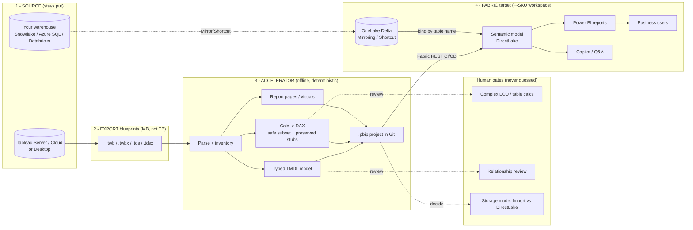
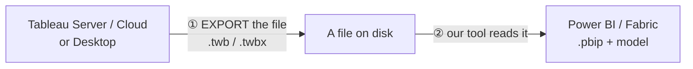

# Tableau → Power BI / Microsoft Fabric Migration Accelerator

A proof-backed accelerator for migrating a Tableau estate to Power BI / Microsoft
Fabric semantic models. Built to answer a customer's core question honestly:

> *"Does Microsoft have a native strategy, accelerator, or recommended approach to
> parse Tableau TWB/TWBX files, extract calculations and lineage, and accelerate
> creation of Power BI / Fabric semantic models or PBIP projects?"*

Short answer: **there is no GA first-party one-click Tableau→Power BI converter.**
What exists is a repeatable, **evidence-backed accelerator** that automates the
mechanical 80% (schema, data types, safe-subset calc→DAX, TMDL, an openable PBIP)
and clearly flags the 20% that stays a human decision (complex LOD/table calcs,
ambiguous relationships, storage-mode choice, native-source rebind). This folder
proves that with a real offline run.

## Contents

A map of this README and the deep-dive docs, so anyone can jump straight to what they need.

**Start here**
- [Big picture (end-to-end architecture)](#big-picture-end-to-end)
- [Quick start (working result in ~60 seconds)](#quick-start-get-a-working-result-in-60-seconds)
- [The journey at a glance](#the-journey-at-a-glance) — the 3 stages, one table
- [Clone-to-completion in 5 steps](#clone-to-completion-in-5-steps) — fresh clone → openable model
- [Step 0 — Get your Tableau files out](#step-0--get-your-tableau-files-out-and-staging-a-large-estate)
- [Convert a report — one command](#convert-a-tableau-report-to-a-power-bi-semantic-model-one-command)

**What you get & how it works**
- [What's here](#whats-here) — the repo map (folders & files)
- [The offline proof (what actually ran)](#the-offline-proof-what-actually-ran)
- [What happens to my dashboards & visuals?](#what-happens-to-my-dashboards--visuals)
- [Is the model ready for Copilot / Q&A?](#is-the-model-ready-for-copilot--qa)
- [Calculations, LOD, parameters & custom SQL](#how-does-it-handle-my-calculations-lod-expressions-parameters--custom-sql)

**Scale & operations**
- [Planning a large estate (150+ workbooks)](#planning-a-large-estate-eg-150-workbooks--what-to-expect)
- [Reproduce the run](#reproduce-the-run)
- [Recreate the sample](#recreate-the-sample-optional)
- [Publish into Fabric (Stage 3)](#publish-into-fabric-stage-3)
- [Provenance & honesty note](#provenance--honesty-note)

**Deep-dive docs** (`docs/`)
- [Customer response](docs/customer-response.md) · [Architecture](docs/architecture.md) · [Real-source binding runbook](docs/real-source-binding-runbook.md)
- [Assessment methodology](docs/assessment-methodology.md) · [Competitive analysis](docs/competitive-analysis.md)
- [DirectLake & mirroring flow](docs/directlake-mirroring-flow.md) · [Semantic-model best practices](docs/semantic-model-best-practices.md)

## Big picture (end to end)

Keep your data where it is; migrate the **intelligence** (models, calculations, reports) as
reviewable **code**, and serve it on Fabric via **DirectLake**. This is **source-agnostic** —
your system of record can be **Snowflake, Azure SQL, Databricks, Fabric SQL, or any warehouse**;
the model binds by table name, so the ingestion path can change without rewriting the model.



**What stays, what moves, what a human decides:**

| Layer | What we present | The reassurance it gives |
|---|---|---|
| **Source** | Tableau + your warehouse stay authoritative | No data fork; reversible until each wave is signed off |
| **Export** | You move *blueprints* (workbook XML + calc/lineage), not rows | A 150-workbook estate is megabytes; data never leaves the warehouse |
| **Accelerator** | Offline, deterministic parse → **TMDL + DAX + `.pbip`** | Same input → same output; fully auditable; no cloud or credentials |
| **Human gates** | Three things it *refuses to guess* | Correct-or-abstain: you're never handed a silently-wrong model |
| **Fabric** | DirectLake over OneLake, PBIP-in-Git, deployed by REST | All-Fabric end state, no import-refresh windows, Copilot-ready |

Full reference — the two migration motions, the phased rollout, and the automated-vs-manual
matrix — is in [docs/architecture.md](docs/architecture.md).

## Quick start (get a working result in ~60 seconds)

**The only prerequisite is Python 3.11+** on your PATH — nothing else for the offline core
(no `pip install`, no internet, no Azure). Check it with `py -3.11 --version` (Windows) or
`python3 --version`. On **macOS/Linux**, install **PowerShell 7** to use the wrapper, or run the
engine directly (last block below).

```powershell
# 1 · Clone and enter the repo
git clone https://github.com/rasgiza/tableau-migration-accelerator.git
cd tableau-migration-accelerator

# 2 · (Windows, once per session) allow the local script to run
Set-ExecutionPolicy -Scope Process -ExecutionPolicy RemoteSigned

# 3 · Convert the bundled sample — offline, one command
.\scripts\Convert-TableauToPowerBI.ps1 -Source .\sample\Superstore.twb -Output .\out
```

**What you get** in `.\out`: a typed **TMDL** semantic model, safe calc→**DAX** (originals kept
as annotations), an openable **`.pbip`**, and a `report.json` + `summary.md`.
**Open it:** double-click `out\pbip\Superstore\Superstore.pbip` in **Power BI Desktop**.

> **Heads-up — the sample ends with `[FAIL] Definition of done` on purpose.** That is *not* a
> bug: everything mechanical (schema, types, calc→DAX, PBIP) is done, and the run stops at the
> one thing it refuses to guess — the **storage-mode decision** (Import vs. DirectLake). Making
> that call, then finishing the flagged 20%, is [Stage 2–3](#the-journey-at-a-glance). Correct-or-
> abstain is the whole point: the tool never silently ships a model it can't stand behind.

**Convert your own workbook, or a whole folder of exports:**

```powershell
.\scripts\Convert-TableauToPowerBI.ps1 -Source C:\exports\MyDashboard.twbx
.\scripts\Convert-TableauToPowerBI.ps1 -Source C:\exports\all-workbooks -Output C:\out
```

**No PowerShell (macOS/Linux, or CI)?** Call the engine directly — same result, no wrapper.
Point `-i` at a file *or* a folder; `-o` is the output bundle:

```bash
python3 engine/skills/tableau-migration/scripts/migrate_estate.py -i ./sample -o ./out
```

That's the whole offline loop. For bulk-exporting a real estate, publishing to Fabric, and the
full walkthrough, keep reading.

## The journey at a glance

Three stages take you from a Tableau file to a live Fabric report. **Stage 1 is the
one you run today**; stages 2–3 are the same tool pointed at the cloud.

| Stage | You run | You get | Needs |
|---|---|---|---|
| **1 · Convert** (offline) | `Convert-TableauToPowerBI.ps1 -Source <file>` | Typed TMDL model + calc→DAX + openable `.pbip` | Python 3.11 only — no internet, no Azure |
| **2 · Open & finish** | Open the `.pbip` in Power BI Desktop | Visual QA + finish the flagged 20% (LODs, table calcs, storage mode) | Power BI Desktop |
| **3 · Publish to Fabric** | `deploy_to_fabric.py --config fabric-deploy.json` | Model + report live in your Fabric workspace | `az login` + a Fabric workspace |

> **Where DirectLake fits:** the target end-state is the semantic model bound in
> **DirectLake mode over Delta tables in OneLake** — all-Fabric, no import copy. The
> engine already emits DirectLake TMDL when you opt in; landing the data as Delta and
> auto-binding the Lakehouse at deploy time is the active roadmap (see
> [Publish into Fabric](#publish-into-fabric-stage-3) below). DirectLake is always
> **opt-in** — the tool never silently picks it for you.

## Clone-to-completion in 5 steps

The whole arc, from a fresh `git clone` to an openable model + a shareable report.
Each step links to the deeper section below.

1. **Clone + check prerequisites.** You need **Python 3.11+** — nothing else for the
   offline core (no `pip install`, no internet, no Azure). On **macOS/Linux** install
   **PowerShell 7** to use the wrapper, or call `migrate_estate.py` directly.
   ```powershell
   git clone <repo-url>
   cd tableau-accelerator
   ```
2. **Get your Tableau files out** ([Step 0](#step-0--get-your-tableau-files-out-and-staging-a-large-estate)).
   Export the `.twb`/`.twbx` **blueprints** (not the data) from Tableau into a folder —
   by hand for a few, or via REST API / `tabcmd` / Content Migration Tool for 150+.
3. **Convert — offline** ([one command](#convert-a-tableau-report-to-a-power-bi-semantic-model-one-command)).
   Point the tool at a file *or the whole folder*:
   ```powershell
   .\scripts\Convert-TableauToPowerBI.ps1 -Source C:\exports\all-workbooks -Output C:\out
   ```
   You get, per workbook: a typed **TMDL** model, safe calc→**DAX** (originals kept), an
   openable **`.pbip`**, and — for the whole run — a self-contained
   **`migration-report.html`** you can open or hand to the customer.
   > First run with **zero setup**? Use the bundled sample:
   > `.\scripts\Convert-TableauToPowerBI.ps1 -Source .\sample\Superstore.twb`
   > (On a fresh Windows box, unblock scripts once per session:
   > `Set-ExecutionPolicy -Scope Process -ExecutionPolicy RemoteSigned`.)
4. **Open & finish in Power BI Desktop.** Open the `.pbip`, do a visual QA pass, and
   finish the flagged 20% the report calls out — LOD/table-calc stubs, storage-mode
   choice, native-source rebind.
5. **Publish to Fabric** ([Stage 3](#publish-into-fabric-stage-3), optional).
   ```powershell
   az login
   # edit fabric-deploy.json -> set "workspace"
   py -3.11 engine/skills/tableau-migration/scripts/deploy_to_fabric.py --config fabric-deploy.json
   ```
   Pushes each model + report into your workspace (add `--dry-run` to preview), then set
   credentials in the Fabric portal and refresh. DirectLake-into-OneLake is the opt-in
   roadmap end-state.

> **The report is automatic.** Every convert run writes `migration-report.html` beside
> `report.json` in the output folder — an estate-wide, offline, no-JavaScript view of
> coverage, per-workbook sign-off, calc lineage, and the remaining manual follow-ups.
> It's the shareable "what happened" artifact; a red definition-of-done gate stays red.

## Step 0 — Get your Tableau files out (and staging a large estate)

Before the tool runs, you need the Tableau **files** on disk. This is the "download the
report" step, and it happens *inside Tableau* — it's the same whether you migrate 1
workbook or 150.



**You're exporting blueprints, not data.** A `.twb`/`.twbx` is the workbook XML + its
datasource definitions (and, for `.twbx`, a packaged `.hyper` extract). Even a large
estate is usually **megabytes of files, not terabytes of rows** — the actual data stays
in your warehouse and gets rebound at the destination (DirectLake / DirectQuery). So do
**not** try to "download all the data locally to carry it over"; just pull the files.

**One or a few workbooks** — export by hand:

- **Tableau Desktop:** File → Export Packaged Workbook → `.twbx`.
- **Tableau Server / Cloud:** open the workbook → Download → Tableau Workbook → `.twbx`.

**A large estate (e.g. 150+ workbooks)** — bulk-export with a script, not by hand:

| Method | What it is | Good for |
|---|---|---|
| **Tableau REST API** (`Download Workbook`) | Loop over every workbook, save each `.twbx` | 150+ workbooks, repeatable |
| **`tabcmd get`** (CLI) | One command per workbook, easy to loop | Mid-size batches |
| **Content Migration Tool** (Server Management) | Admin-run bulk content mover with a UI | Governed environments |

Each of these produces a **folder full of `.twb`/`.twbx` files** — which is exactly what
you point the tool at (`-Source C:\exports\all-workbooks`). It walks the whole folder in
one deterministic batch.

**Recommended pattern for a big estate:**

1. **Bulk-export centrally, not on a laptop.** Run the REST API / `tabcmd` from a **server
   or CI runner** (ideally **x64**, so packaged `.twbx` extracts don't warn-and-skip — see
   [Will this run on my teammates' machines?](#will-this-run-on-my-teammates-machines)).
   You get an inventory in the same pass.
2. **Migrate in waves, not one big bang.** Batch by data source or business area:
   convert → review the flagged worklist → publish. This keeps the human-review 20%
   manageable and gives leadership visible progress.
3. **Treat the local folder as throwaway staging.** Tableau Server stays the source of
   truth until each wave is signed off. Re-export and re-run is free — the engine is
   deterministic.
4. **Don't drag the data along.** Bind to the live warehouse (or land as Delta for
   DirectLake) at the destination. The optional `.hyper` reader is only for rare
   offline-only workbooks.

## Convert a Tableau report to a Power BI semantic model (one command)

This is the shareable tool. Point it at any Tableau file — get a Power BI/Fabric
semantic model + an openable PBIP back.

```powershell
# from the tableau-accelerator folder
.\scripts\Convert-TableauToPowerBI.ps1 -Source .\sample\Superstore.twb
```

Or against your own workbook / a whole folder of exports:

```powershell
.\scripts\Convert-TableauToPowerBI.ps1 -Source C:\exports\MyDashboard.twbx
.\scripts\Convert-TableauToPowerBI.ps1 -Source C:\exports\revenue-cycle -Output C:\out\rc
```

What it does, in order:
1. Stages the Tableau file(s) — a single `.twb` also pulls in its sibling `.tds`
   datasource so calculations resolve.
2. **Scans** datasource bindings and flags any *published* datasource that must be
   fetched first (won't silently produce a partial model).
3. **Builds** the typed **TMDL** semantic model, translates the safe subset of
   calculations to **DAX** (originals preserved), and emits an openable **`.pbip`**.
4. Copies the bundle to `-Output` (default `.\output`) and prints a summary +
   the exact `.pbip` path to open in Power BI Desktop.

Requirements: **Python 3.11+** (the script auto-detects `py -3.11` / `python`).
No live Tableau, no Tableau Desktop, no internet.

### Will this run on my teammates' machines?

Yes. The engine is **pure Python 3.11 standard library — zero `pip install`** for the
core migration (parse `.twb`/`.tds`, translate calcs → DAX, build the TMDL semantic
model + `.pbip` report + native visuals). That core runs identically on **Windows
(x64 and ARM64), macOS (Intel and Apple Silicon), and Linux**. The PowerShell wrapper
is Windows-only, but the underlying `migrate_estate.py` runs anywhere Python does.

There is exactly **one optional native dependency**, `tableauhyperapi`, used *only* to
read the data baked inside packaged `.twbx` files (the `.hyper` extract). It is not
required for the deliverable and the engine **warns-and-skips** when it is absent — it
never crashes. Install it only if you need to crack open packaged extracts:

```powershell
py -3.11 -m pip install tableauhyperapi
```

Availability: x64 Windows / x64 Linux / macOS ✅. **Windows-on-ARM is the one gap**
(Salesforce ships no ARM wheel) — on those machines packaged `.twbx` extracts warn and
skip; run just those on any x64 box or CI runner, or bind to the live warehouse instead
(the usual real-project path, where `.hyper` reading is never needed).

## What's here


| Path | What it is |
|---|---|
| `engine/` | Cloned [`tableau-fabric-skills`](https://github.com/Yarbrdab000/tableau-fabric-skills) — the community/field migration engine (the `tableau-migration` skill is the workhorse). |
| `sample/` | `Superstore.tds` + `Superstore.twb` — a real-shaped sample datasource + workbook (offline; no live Tableau needed). |
| `customer-estate/` | A 13-workbook offline **test estate** (diverse shapes: live SQL, `.hyper` + legacy `.tde` extracts, federated, flat-file) — the corpus behind the breadth / resilience test. |
| `scripts/Convert-TableauToPowerBI.ps1` | **The shareable tool** — one-command wrapper over the engine. |
| `output/` | **The proof.** The actual generated bundle from a run: TMDL semantic model, calc→DAX measures, and an openable `.pbip`. |
| `docs/customer-response.md` | Honest answers to the customer's 5 questions. |
| `docs/architecture.md` | Reference architecture + the two migration motions + phased Revenue-Cycle-first plan. |
| `docs/real-source-binding-runbook.md` | **Worked example against a real backend.** End-to-end native-source rebind on Azure SQL: provisioning, Entra-only auth, giving each datasource a resolvable descriptor, re-running to bind two workbooks — plus best-practice validation vs. real enterprise migrations. |
| `docs/assessment-methodology.md` | How to size a 150-workbook estate and estimate effort. |
| `docs/competitive-analysis.md` | How we compare to public migration guides / commercial accelerators, and the ranked ideas worth stealing. |
| `docs/directlake-mirroring-flow.md` | How the accelerator reaches a **DirectLake** end state — where mirroring fits and how workbooks map to semantic models at estate scale. |
| `docs/semantic-model-best-practices.md` | The modeling guardrails and what stays a human step when the target is **DirectLake + Copilot/Q&A**. |
| `engine/skills/tableau-migration/resources/viz-rebuild.md` | The visual layer: which Tableau chart types rebuild into which Power BI visuals, and what is deferred to a warning. |

## The offline proof (what actually ran)

The engine parsed a Superstore datasource + workbook **entirely offline** and produced:

- **1 semantic model** (`output/semantic_models/Superstore.SemanticModel`) as typed TMDL
  — column types taken from the Tableau schema, never inferred.
- **2 of 3 calculations auto-translated to DAX**, deterministically:
  - `Total Sales`: `SUM([Sales])` → `SUM('Orders'[Sales_Amount])`
  - `Profit Ratio`: `SUM([Profit]) / SUM([Sales])` → `DIVIDE(SUM('Orders'[Profit]), SUM('Orders'[Sales_Amount]))`
    *(note the engine chose `DIVIDE` for safe division — not a naive `/`)*
  - `Running Sales`: `RUNNING_SUM(SUM([Sales]))` → **left as an inert stub**, original
    formula preserved as a `TableauFormula` annotation (table calcs are a manual step).
- **An openable `.pbip`** project (`output/pbip/Superstore/Superstore.pbip`).
- **A self-contained `migration-report.html`** — an offline exec view of the run (coverage
  KPIs, definition-of-done sign-off, calculation lineage, and the exact manual follow-ups),
  rendered from `report.json` with no server, no JS, and no external assets.
- **A definition-of-done gate that failed loud** on the workbook report binding because
  the engine **refuses to auto-pick** a storage mode (Import vs. DirectLake) — exactly the
  kind of honest, human-in-the-loop behavior you want when telling a customer what is and
  isn't automated.

This is the honest headline: **the boring, error-prone 80% is automated and auditable;
the judgement 20% is surfaced, never silently guessed.**

## What happens to my dashboards & visuals?

The tool does **not** screenshot or image-convert a dashboard. It reads the dashboard's
underlying **viz grammar** (the workbook XML — marks, shelves, encodings, filters, and zone
layout) and rebuilds **native, live Power BI visuals** bound to the migrated model. You get an
interactive `.pbip` report, not a flat picture. Fidelity splits into two layers:

| Layer | What it covers | Fidelity |
|---|---|---|
| **Semantic model** (data + calcs) | Types, tables, relationships, safe calc→DAX. **The deliverable.** | High — typed TMDL, deterministic |
| **Report / visuals** | Chart types, field bindings, dashboard layout | Structural — faithful for the supported set; polish expected |

**Chart types rebuilt faithfully** (see [viz-rebuild.md](engine/skills/tableau-migration/resources/viz-rebuild.md) for the full mapping table): bar/column (incl. stacked), line, area, dual-axis combo, table, matrix/highlight table, pie, scatter, filled/point maps, cards, and slicers. Dashboard canvas size and zone positions are mapped, and axis sorts are preserved when the sort measure is bound.

**Deferred to a structured warning (never guessed wrong):** exotic marks (treemap, packed bubbles, polygons, Gantt), exact formatting (fonts, colors, tooltips, conditional formatting), filter-scope semantics (a Tableau filter card ≠ a Power BI slicer), reference lines, annotations, and dashboard actions. These are surfaced for a human to finish.

**Every visual is scored.** The `fidelity_oracle` is a separately-authored second opinion that re-reads both sides from disk and reports a per-visual 0..1 agreement across four components — chart-type family, field bindings, role split (axis vs. value), and dashboard layout position — so you get a punch-list of exactly which visuals matched and which need hand-finishing, rather than a guess.

Bottom line: it removes the mechanical rebuild (recreating dozens of charts from scratch and
rebinding every field) and hands a designer a **live, openable report to refine** — not a blank
canvas and not a static image.

## Is the model ready for Copilot / Q&A?

A correct model can still give **Copilot and Power BI Q&A weak answers** if its fields carry no
descriptions, no synonyms, or expose inert placeholder measures. So the accelerator ships the model
**Copilot-ready by default** — three additive, offline, deterministic touches:

- **Honest field descriptions.** Every migrated measure gets a one-line description Copilot can
  ground on. A translated measure records its provenance; an untranslated **stub is flagged
  "needs manual review"** — never dressed up as done.
- **Q&A synonyms.** Tableau field captions that differ from their model column names are harvested
  into a Power BI **linguistic `cultureInfo`** layer, so a user asking for "revenue" maps to the
  `Sales` field.
- **A readiness scorecard.** `report.json` gains a `copilot_readiness` block and
  `migration-report.html` shows a **Copilot / Q&A readiness** section — an overall verdict
  (`ready` / `ready with warnings` / `not ready`) plus per-check coverage (measure translation,
  synonyms, descriptions), so you can see what to fix before wiring up Copilot.

These touches are **TMDL description comments and a separate culture part** — they never change a
measure's DAX or a column's type, and the enriched model still passes the openability self-check.
Prefer the leaner, description-free model? Pass `--no-copilot-ready`.

**An honest limit — and what you must add.** The accelerator produces a Copilot-**ready scaffold**,
not a Copilot-**grounded** model. It cannot invent business meaning that the Tableau source never
carried — and Tableau workbooks rarely store field descriptions. The auto-generated measure
descriptions record **provenance** ("migrated from a Tableau calc"), not what a field *means*.

**You do not have to fix every table.** The scaffold is safe and openable exactly as migrated —
nothing is broken if you enrich nothing. For Copilot quality you only touch the fields users actually
ask about, which is typically a few dozen, not thousands. The `migration-report.html` scorecard ends
with a **"Make this fully AI-ready"** checklist that scopes it:

- **Enrich only what's visible** — the measures and slicer columns people query (revenue, margin,
  region, product). Add a short plain-language **business description** to each. This is the single
  biggest lever on answer quality.
- **Hide, don't describe, the plumbing** — surrogate keys, ID columns, and technical/staging fields
  need no description at all; just **hide** them so Copilot ignores them. That removes most of the
  model from your to-do list.
- **Curate Q&A synonyms** — add the words your users actually say (abbreviations, jargon, alternate
  names) beyond the captions harvested automatically.
- **Prep the kept fields** — friendly names, mark the date table, verify relationship cardinality and
  cross-filter direction.
- **Resolve the "needs manual review" stubs** before exposing them to Copilot — an inert stub returns
  0, and Copilot will answer from it as if it were real.

This is a **one-time curation done on the published semantic model** as normal stewardship — not a
task you repeat on every migration, and re-running the accelerator won't undo it unless you overwrite
the model file.

## How does it handle my calculations, LOD expressions, parameters & custom SQL?

This is the question most estates actually care about. A large customer told us they had
*"150+ Tableau workbooks; thousands of calculations, LOD expressions, parameters, and custom
SQL."* Here is exactly what the engine does with each — automated where it can be **proven**,
flagged (never silently guessed) where it can't:

| Tableau construct | What the engine does | Confidence |
|---|---|---|
| **Calculations** (arithmetic, logical, string, date, standard aggregations) | Deterministically translated to **DAX**, original formula preserved as a `TableauFormula` annotation. Safe division becomes `DIVIDE()`, not a naive `/`. | High — auto |
| **Calculations** (table calcs, `RUNNING_SUM`, `WINDOW_*`, rank, nested/argmax) | Emitted as an **inert, labeled stub** with the original formula attached, so it's a visible TODO — never a wrong number that ships. | Flagged for review |
| **LOD — `FIXED`** over a real/derived grain (e.g. `{FIXED [Order Date (Months)] : SUM([Sales])}`) | Detected, bound to a real calculated column, and translated. | High — auto (tractable cases) |
| **LOD — `INCLUDE` / `EXCLUDE`, nested LODs, argmax** | Detected and **handed off** rather than force-fit into wrong DAX (no clean 1:1 exists). | Flagged for review |
| **Parameters — value / what-if** | Rebuilt as a disconnected what-if table + a `[<Param> Value]` measure. | High — auto |
| **Parameters — field/measure swap** | Rebuilt as native **Power BI field parameters**. | High — auto |
| **Parameters — plain filter** | Surfaced for review (a Tableau filter card ≠ a Power BI slicer). | Flagged for review |
| **Custom SQL** (foldable) | Flows through as a native query with correct de-escaping and parameter-reference extraction. | High — auto |
| **Custom SQL** (unfoldable cross-engine joins/unions, unknown connector) | **Reported**, not dropped, so a human rebinds it. | Flagged for review |

**What to expect at estate scale.** On a calc-heavy stress-test estate, a single run auto-translated
~28% of workbook calcs and flagged the rest — that number is *deliberately conservative* because the
engine refuses to guess. Real production estates skew far higher, because most calcs are simple
arithmetic/logical expressions. The value is not "100% automatic": it is that the tool does the
mechanical majority and hands your team a **precise, per-construct worklist** of exactly what needs a
human — instead of forcing them to hunt for what silently broke.

**Guiding principle — *warn, never wrong*.** Every run ends with a definition-of-done gate that fails
*loud* when it cannot prove a binding (e.g. it will not auto-pick Import vs. DirectLake storage mode).
A red gate is the tool being honest, not broken — it converts what it can prove and refuses to guess
the rest.

## Planning a large estate (e.g. 150+ workbooks) — what to expect

If you are sizing a real migration, tell the customer these four things up front. It is an
**accelerator, not a zero-touch converter** — and that distinction is the whole value.

1. **Plan for a review pass.** Expect a meaningful flagged/stubbed list on any large estate. The
   value is not "100% automatic" — the tool does the mechanical majority, tells you *exactly* which
   calcs/LODs/custom-SQL need a human, and **never ships a wrong measure** (see the construct table
   above).
2. **Storage mode is deliberately not guessed.** It will not auto-pick DirectLake vs. Import; it
   binds what it can prove and flags the rest for you to point at the live warehouse. A red
   definition-of-done gate here is expected, not a failure.
3. **Packaged `.twbx` extract reading needs x64.** The one optional native dependency
   (`tableauhyperapi`) has no Windows-on-ARM wheel. For a 150-workbook batch, run the estate on an
   **x64 box or CI runner** — otherwise packaged-data workbooks warn-and-skip (see
   [Will this run on my teammates' machines?](#will-this-run-on-my-teammates-machines) above).
4. **Visual fidelity is "close, needs eyeballing."** Charts rebuild as native, live Power BI
   visuals, but complex vizzes want a visual QA pass — the `fidelity_oracle` hands you a per-visual
   punch-list of exactly which ones matched and which need hand-finishing (see
   [What happens to my dashboards & visuals?](#what-happens-to-my-dashboards--visuals) above).

**Bottom line for the customer conversation:** it collapses the mechanical majority of a
150-workbook migration into a deterministic, repeatable, **offline** batch, and — crucially — hands
the team a **precise, labeled worklist** for the LOD / custom-SQL / calc tail instead of forcing them
to hunt for what silently broke. At that scale, "here is exactly what needs a human" is worth more
than the raw conversion percentage.

## Reproduce the run

Just run the tool (see the one-command section above):

```powershell
.\scripts\Convert-TableauToPowerBI.ps1 -Source .\sample\Superstore.twb
```

Open `output\pbip\Superstore\Superstore.pbip` in Power BI Desktop to validate visually.

<details>
<summary>Advanced: call the engine directly</summary>

```powershell
$SKILL = "$PWD\engine\skills\tableau-migration"
$RUN   = (py -3.11 "$SKILL\scripts\new_run.py" --root C:\tfmig)   # mints a clean run folder
Copy-Item .\sample\Superstore.tds, .\sample\Superstore.twb (Join-Path $RUN 'in') -Force
py -3.11 "$SKILL\scripts\migrate_estate.py" -i (Join-Path $RUN 'in') -o (Join-Path $RUN 'out') --scan   # gate
py -3.11 "$SKILL\scripts\migrate_estate.py" -i (Join-Path $RUN 'in') -o (Join-Path $RUN 'out')          # build
```
</details>

## Recreate the sample (optional)

The sample is materialized from the engine's own synthetic fixtures (a real-shaped
Superstore datasource + workbook), so no Tableau Desktop or Tableau Public download is
required:

```powershell
$fix = "$PWD\engine\skills\tableau-migration\tests\integration"
py -3.11 -c "import sys; sys.path.insert(0, r'$fix'); import fixtures; fixtures.materialize_superstore(r'$PWD\sample')"
```

To run against a **real** workbook instead, drop any `.twb`/`.twbx` (or `.tds`/`.tdsx`)
into `sample\` and re-run — the engine ingests packaged files directly.

## Publish into Fabric (Stage 3)

Once a bundle is converted and you've finished the flagged items, one stdlib-only
script pushes it into a **Fabric workspace** over the Fabric REST API — no Power BI
Desktop, no secrets in any file.

**Step by step:**

0. **Create the destination first (one-time, in the Fabric portal).** Before running the
   script, a **Fabric workspace** must exist on a Fabric capacity — and for the **DirectLake**
   target, a **Lakehouse** inside it too (that lakehouse's OneLake `Tables/` path is where the
   data lands and what the model points at). The script publishes *into* these; it does **not**
   create the workspace or lakehouse for you. (DirectQuery/Import need only the workspace.)
1. **Sign in.** `az login` (the script uses your Azure CLI token by default — or pass
   `--token` / set `FABRIC_TOKEN` to skip the CLI entirely).
2. **Point it at your workspace.** Open [`fabric-deploy.json`](fabric-deploy.json) and set
   `"workspace"` to your Fabric workspace **name or GUID**. List the bundles you want to
   publish (or set `pbip_dir` to auto-discover every bundle in a folder).
3. **Deploy.**

   ```powershell
   py -3.11 engine/skills/tableau-migration/scripts/deploy_to_fabric.py --config fabric-deploy.json
   ```

   This pushes each **semantic model** and its **report** (createOrUpdate with
   long-running-operation polling), rebinds the report to its model, and — if
   `"refresh": true` — triggers a refresh.
4. **Preview first (optional).** Add `--dry-run` to see exactly what would be sent to
   Fabric without calling it.

**What it does and doesn't do today:**

| Capability | Status |
|---|---|
| Push semantic model + report to a workspace (REST, LRO) | ✅ Ships today |
| Rebind report → model, trigger refresh | ✅ Ships today |
| Friendly failure if `az` isn't installed / not signed in | ✅ Guarded, no raw traceback |
| Emit **DirectLake** TMDL (opt-in) | ✅ Emitter exists |
| Create the Lakehouse, land data as **Delta in OneLake**, auto-bind DirectLake | 🚧 Roadmap (see below) |

> **Credentials stay manual — by design.** The script binds items and refreshes, but it
> **never enters datasource credentials**. Set the connection in the Fabric portal before
> refreshing a DirectQuery/DirectLake model. A 401/403 on refresh means "go configure the
> connection," not a bug.

### The DirectLake-into-OneLake destination (roadmap)

The end-state is the migrated model bound in **DirectLake mode over Delta tables in
OneLake**. It lands in three opt-in phases, each preserving clone-and-run (stdlib + REST
+ az-token, no new `pip` deps):

1. **Select + emit** *(offline, testable now)* — opt-in `--storage-mode directlake`
   stamps DirectLake TMDL with a Lakehouse **placeholder** and emits a "land these tables
   as Delta" worklist. No Azure calls.
2. **Deploy rail** — `deploy_to_fabric.py` ensures/creates a Lakehouse, resolves its SQL
   endpoint, substitutes the placeholder, and binds the model.
3. **Data landing** — extract/flat-file → load Delta into the Lakehouse; live warehouse →
   create a shortcut (no copy).

DirectLake is always **opt-in**; storage mode remains a deliberate human decision, never
auto-guessed.

## Provenance & honesty note

- The `engine/` is a **community/field** project (MIT), not a shipping Microsoft product.
  It wraps deterministic parsing + the official Tableau MCP server where live access is used.
- Power BI **TMDL**, **PBIP + Git**, **DirectLake**, **Fabric REST**, and **Copilot for DAX**
  are the first-party Microsoft building blocks this accelerator stands on.
- See `docs/customer-response.md` for the precise line between "GA product,"
  "field accelerator," and "manual effort."
