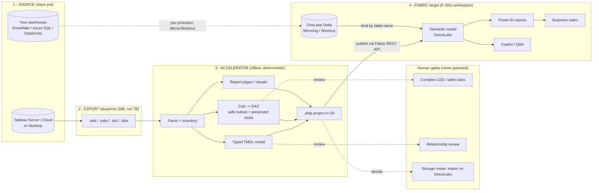
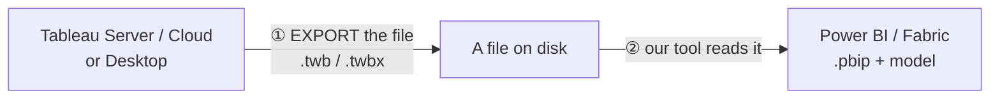

# Tableau → Power BI / Microsoft Fabric Migration Accelerator

A proof-backed accelerator for migrating a Tableau estate to Power BI / Microsoft
Fabric semantic models. Built to answer a customer's core question honestly:

> *"Does Microsoft have a native strategy, accelerator, or recommended approach to
> parse Tableau TWB/TWBX files, extract calculations and lineage, and accelerate
> creation of Power BI / Fabric semantic models or PBIP projects?"*

Short answer: **there is no GA first-party one-click Tableau→Power BI converter.**
What exists is a repeatable, **evidence-backed accelerator** that automates the
mechanical 80% (schema, data types, safe-subset calc→DAX, TMDL, an openable PBIP)
and clearly flags the 20% that stays a human decision (complex LOD/table calcs,
ambiguous relationships, storage-mode choice, native-source rebind). This folder
proves that with a real offline run.

## Contents

A map of this README and the deep-dive docs, so anyone can jump straight to what they need.

**Start here**
- [Big picture (end-to-end architecture)](#big-picture-end-to-end)
- [Quick start (working result in ~60 seconds)](#quick-start-get-a-working-result-in-60-seconds)
- [Recommended way to test the accelerator](#recommended-way-to-test-the-accelerator) — what each test proves, in what order
- [The journey at a glance](#the-journey-at-a-glance) — the 3 stages + the end-to-end commands
- [Step 0 — Get your Tableau files out](#step-0--get-your-tableau-files-out-and-staging-a-large-estate)
- [Convert a report — one command](#convert-a-tableau-report-to-a-power-bi-semantic-model-one-command)

**What you get & how it works**
- [Opening the `.pbip` in Power BI Desktop](#opening-the-pbip-in-power-bi-desktop--prerequisites--troubleshooting) — prerequisites & the two most common open errors
- [What's here](#whats-here) — the repo map (folders & files)
- [The offline proof (what actually ran)](#the-offline-proof-what-actually-ran)
- [What happens to my dashboards & visuals?](#what-happens-to-my-dashboards--visuals)
- [Is the model ready for Copilot / Q&A?](#is-the-model-ready-for-copilot--qa)
- [Calculations, LOD, parameters & custom SQL](#how-does-it-handle-my-calculations-lod-expressions-parameters--custom-sql)
- [The migration report — what it couldn't do, too](#the-migration-report--it-tells-you-what-it-couldnt-do-too)

**Scale & operations**
- [Planning a large estate (150+ workbooks)](#planning-a-large-estate-eg-150-workbooks--what-to-expect)
- [Reproduce the run](#reproduce-the-run)
- [Recreate the sample](#recreate-the-sample-optional)
- [Publish into Fabric (Stage 3)](#publish-into-fabric-stage-3)
- [Provenance & honesty note](#provenance--honesty-note)

**Deep-dive docs** (`docs/`)
- [Customer response](docs/customer-response.md) · [Architecture](docs/architecture.md) · [Real-source binding runbook](docs/real-source-binding-runbook.md)
- [Assessment methodology](docs/assessment-methodology.md) · [Competitive analysis](docs/competitive-analysis.md)
- [DirectLake & mirroring flow](docs/directlake-mirroring-flow.md) · [Semantic-model best practices](docs/semantic-model-best-practices.md)

## Big picture (end to end)

Keep your data where it is; migrate the **intelligence** (models, calculations, reports) as
reviewable **code**, and serve it on Fabric via **DirectLake**. This is **source-agnostic** —
your system of record can be **Snowflake, Azure SQL, Databricks, Fabric SQL, or any warehouse**;
the model binds by table name, so the ingestion path can change without rewriting the model.


```mermaid
flowchart LR
    subgraph SRC["1 - SOURCE (stays put)"]
        TAB[(Tableau Server / Cloud<br/>or Desktop)]
        WH[(Your warehouse<br/>Snowflake / Azure SQL / Databricks)]
    end
    subgraph EXPORT["2 - EXPORT blueprints (MB, not TB)"]
        FILES[.twb / .twbx / .tds / .tdsx]
    end
    subgraph ACCEL["3 - ACCELERATOR (offline, deterministic)"]
        PARSE[Parse + inventory] --> MODEL[Typed TMDL model]
        PARSE --> CALC[Calc -> DAX<br/>safe subset + preserved stubs]
        PARSE --> VIZ[Report pages / visuals]
        MODEL --> PBIP[.pbip project in Git]
        CALC --> PBIP
        VIZ --> PBIP
    end
    subgraph GATES["Human gates (never guessed)"]
        LOD[Complex LOD / table calcs]
        REL[Relationship review]
        STORE[Storage mode: Import vs DirectLake]
    end
    subgraph FABRIC["4 - FABRIC target (F-SKU workspace)"]
        OL[(OneLake Delta<br/>Mirroring / Shortcut)]
        SM[Semantic model<br/>DirectLake]
        RPT[Power BI reports]
        COP["Copilot / Q&A"]
        USERS[Business users]
    end
    TAB --> FILES --> PARSE
    WH -. you provision: Mirror/Shortcut .-> OL
    PBIP -->|publish via Fabric REST API| SM
    OL -->|bind by table name| SM
    SM --> RPT --> USERS
    SM --> COP
    CALC -.review.-> LOD
    MODEL -.review.-> REL
    PBIP -.decide.-> STORE
```

**What stays, what moves, what a human decides:**

| Layer | What we present | The reassurance it gives |
|---|---|---|
| **Source** | Tableau + your warehouse stay authoritative | No data fork; reversible until each wave is signed off |
| **Export** | You move *blueprints* (workbook XML + calc/lineage), not rows | A 150-workbook estate is megabytes; data never leaves the warehouse |
| **Accelerator** | Offline, deterministic parse → **TMDL + DAX + `.pbip`** | Same input → same output; fully auditable; no cloud or credentials |
| **Human gates** | Three things it *refuses to guess* | Correct-or-abstain: you're never handed a silently-wrong model |
| **Fabric** | DirectLake over OneLake, PBIP-in-Git, deployed by REST | All-Fabric end state, no import-refresh windows, Copilot-ready |

Full reference — the two migration motions, the phased rollout, and the automated-vs-manual
matrix — is in [docs/architecture.md](docs/architecture.md).

## Quick start (get a working result in ~60 seconds)

**Which folder do I use?** Three folders, three jobs — this is the whole mental model:

| Folder | What it's for | Who puts files there |
|--------|---------------|----------------------|
| **`sample/`** | One tiny workbook for the 60‑second test below. **Don't edit it.** | Ships with the repo |
| **`sample-workbooks/`** | A gallery of real Tableau *Viz of the Day* dashboards to try bigger, realistic conversions. | Ships with the repo |
| **`workbooks/`** | **Your own / your customer's files.** Drop your `.twb` / `.twbx` / `.tds` / `.tdsx` here and run. | **You** — it's git‑ignored, so nothing sensitive is ever committed |

> **Rule of thumb:** kicking the tires → use `sample/` or `sample-workbooks/`. Doing real work →
> put files in **`workbooks/`**. Output always lands in the folder you pass to `-Output` (e.g. `.\out`).

**The only prerequisite is Python 3.11+** on your PATH — nothing else for the offline core
(no `pip install`, no internet, no Azure). Check it with `py -3.11 --version` (Windows) or
`python3 --version`. On **macOS/Linux**, install **PowerShell 7** to use the wrapper, or run the
engine directly (last block below).

```powershell
# 1 · Clone and enter the repo
git clone https://github.com/rasgiza/tableau-migration-accelerator.git
cd tableau-migration-accelerator

# 2 · (Windows, once per session) allow the local script to run
Set-ExecutionPolicy -Scope Process -ExecutionPolicy RemoteSigned

# 3 · Convert the bundled sample — offline, one command
#    (Superstore.twb ships with the repo; it's just a test file to prove the tool works.
#     Your own / customer workbooks go in the workbooks/ folder — see "Convert your own" below.)
.\scripts\Convert-TableauToPowerBI.ps1 -Source .\sample\Superstore.twb -Output .\out
```

**What you get** in `.\out`: a typed **TMDL** semantic model, safe calc→**DAX** (originals kept
as annotations), an openable **`.pbip`**, and a `report.json` + `summary.md`.
**Open the model:** double-click `out\pbip\Superstore\Superstore.pbip` in **Power BI Desktop**
(first time? see [prerequisites & troubleshooting](#opening-the-pbip-in-power-bi-desktop--prerequisites--troubleshooting) — a `.pbip` needs three preview features turned on).
**Open the report:** double-click `out\migration-report.html` — it opens in your browser (an
estate-wide sizing + fidelity view, no server needed). The run prints both paths when it finishes,
so you never have to go hunting for them.

> **Heads-up — the sample ends with `[FAIL] Definition of done` on purpose.** That is *not* a
> bug: everything mechanical (schema, types, calc→DAX, PBIP) is done, and the run stops at the
> one thing it refuses to guess — the **storage-mode decision** (Import vs. DirectLake). Making
> that call, then finishing the flagged 20%, is [Stage 2–3](#the-journey-at-a-glance). Correct-or-
> abstain is the whole point: the tool never silently ships a model it can't stand behind.

**Try more realistic samples.** The repo also ships a **`sample-workbooks/`** gallery of real
Tableau Public *Viz of the Day* dashboards, so you can convert something meatier on a fresh clone
— no Tableau account, no exporting:

```powershell
.\scripts\Convert-TableauToPowerBI.ps1 -Source .\sample-workbooks -Output .\out
```

**Convert your own workbooks.** Step 3 above used the bundled `sample/` file only to prove the
tool runs, and `sample-workbooks/` is our demo gallery. For **real work** — workbooks you download
from Tableau Online, or a customer's own exports — use the ready-made **`workbooks/`** folder: drop
your `.twb` / `.twbx` / `.tds` / `.tdsx` there (a single file or many), then:

```powershell
.\scripts\Convert-TableauToPowerBI.ps1 -Source .\workbooks -Output .\out
```

Your files in `workbooks/` are git-ignored, so customer workbooks are never committed. You can
also point `-Source` at any path instead — a single file or a folder of exports:

```powershell
.\scripts\Convert-TableauToPowerBI.ps1 -Source C:\exports\MyDashboard.twbx
.\scripts\Convert-TableauToPowerBI.ps1 -Source C:\exports\all-workbooks -Output C:\out
```

**No PowerShell (macOS/Linux, or CI)?** Call the engine directly — same result, no wrapper.
Point `-i` at a file *or* a folder; `-o` is the output bundle:

```bash
python3 engine/skills/tableau-migration/scripts/migrate_estate.py -i ./sample -o ./out
```

That's the whole offline loop. For bulk-exporting a real estate, publishing to Fabric, and the
full walkthrough, keep reading.

## Recommended way to test the accelerator

Evaluating this for real? Test it in the order below — each step needs less trust and more setup
than the last, so you build confidence before touching the cloud. This mirrors how migration
consultancies actually run a Tableau→Power BI/Fabric pilot (convert offline → validate the evidence
→ review in Desktop → land in Fabric in waves); see [competitive-analysis.md](docs/competitive-analysis.md)
for the five public guides this aligns with.

**Do them in this order:**

1. **Convert, then read `migration-report.html` first.** It is offline, opens in any browser, and
   **never errors** — the safest, most honest first look. It shows exactly what converted, the
   per-workbook sign-off, calc lineage, and the remaining manual to-dos. Judge "did it work?" here,
   **not** by whether a model connects yet.
2. *(Optional)* **Open the `.pbip` in Power BI Desktop** to eyeball the model structure (tables,
   columns, relationships, DAX). This is local QA, not the destination —
   [see the prerequisites](#opening-the-pbip-in-power-bi-desktop--prerequisites--troubleshooting) first.
3. **Only when you have a Fabric tenant:** publish to Fabric ([Stage 3](#publish-into-fabric-stage-3)).
   This is the step that proves the *actual migration* lands live.

**What each test actually proves — so you don't misread a result:**

| What you want to prove | Test with | Reality |
|---|---|---|
| "The tool converts and produces a real model" | `migration-report.html` + the `.pbip` on disk | ✅ Instant, offline, no cloud |
| "The model opens and its structure is correct" | Power BI **Desktop** (Stage 2) | ✅ Tables / columns / DAX are visible |
| "Data loads and dashboards light up" | Desktop **with a real live-connected workbook** | ⚠️ The bundled sample points at a **placeholder** source, so it raises a connect error *by design* — use a real workbook + source to see data |
| "It lands live in Fabric" | **Fabric** (Stage 3) | ✅ Only this proves the end-to-end migration; needs your workspace + a data source |
| "The numbers match Tableau" | `-Verify` (opt-in) | ⚠️ Only for calcs the oracle can evaluate over **landed** rows — [see below](#does-it-check-that-the-numbers-are-right) |

> **The one caveat that trips people up:** the bundled `sample/Superstore.twb` is DirectQuery-bound
> to a fake server on purpose (storage mode is [never auto-guessed](#how-does-it-handle-my-calculations-lod-expressions-parameters--custom-sql)).
> Opening it in Desktop shows a correct model but a **SQL connect error** — that is expected, not a
> failure. To see data actually load with zero cloud setup, test with a **real live-connected
> Tableau workbook** (one that points at a database you can reach) dropped in `workbooks/`.

### Does it check that the numbers are right?

In one specific, opt-in case — and it is worth stating exactly, because *translated* and *checked*
are different claims.

A calculation is reported as **translated** when its construct was mappable to DAX. Nothing in a
default run evaluates it against data. Add `-Verify` and the run makes a second pass with a
**reconciliation oracle**: it re-parses the original Tableau formula *and* the generated DAX through
two independent front-ends, evaluates both over the rows actually landed on disk, and reports only
the ones it can prove agree.

Two preconditions decide whether it can report anything at all:

| Precondition | What it means in practice |
|---|---|
| **Rows landed on disk** | A workbook whose data is a bundled `.hyper` extract — the usual Tableau Cloud export — needs the optional Tableau Hyper API (`pip install tableauhyperapi`). The core engine is stdlib-only and will not read extract data without it, and no Windows **ARM64** build of that package is published. No rows on disk means nothing to evaluate against. |
| **The calc is in the oracle's scope** | It examines the calculations recovered by the second-compiler pass — not the ones the deterministic pass already translated — and within that, a supported subset: arithmetic over single-column aggregations on one table. |

When either precondition fails, the summary says so in words instead of printing a zero, because a
silent `0 verified` reads like a check that passed. **Coverage percentages describe translation, not
verified equivalence.** Calculation review stays a required human step.

## Opening the `.pbip` in Power BI Desktop — prerequisites & troubleshooting

The convert step is offline and always succeeds at producing files. **Opening those files is a
separate step that happens inside Power BI Desktop**, and it has its own requirements. If the run
finished but Desktop throws an error on open, it's almost always one of the two causes below — not
a bad conversion.

### Prerequisite — turn on the project preview features (one time)

The engine emits the **modern PBIP layout**: a **TMDL** semantic model plus the **enhanced report
format (PBIR)** (the `definition/pages/.../page.json` folders). Power BI Desktop only opens that
format when it is **reasonably recent** (use a 2024 or newer build) **and** these three
**Preview features** are enabled:

1. **File → Options and settings → Options → Preview features**, tick:
   - **Power BI Project (.pbip) save option**
   - **Store semantic model using TMDL format**
   - **Store reports using enhanced metadata format (PBIR)**
2. Click **OK**, then **fully restart** Power BI Desktop (the features load at startup).
3. Open the `.pbip` via **File → Open**, or double-click `…\pbip\<Name>\<Name>.pbip`.

> If Desktop is older than ~2024, update it first — early builds cannot open PBIR reports at all.

### The two errors people actually hit

| What you see on open | Why | Fix |
|---|---|---|
| *"We couldn't open your report"* / *"unsupported / newer format"* / the `.Report` won't load | The **PBIR preview feature is off** or Desktop is too old for the enhanced report format | Enable the three preview features above and restart; update Desktop if it predates 2024 |
| *"Can't connect"* / a **SQL Server** login, firewall, or timeout error — often the model opens, then fails loading data | The model is **DirectQuery bound to a placeholder (or real-but-uncredentialed) source**. The bundled sample points at `placeholder-store.database.windows.net` on purpose, because storage mode is [never auto-guessed](#how-does-it-handle-my-calculations-lod-expressions-parameters--custom-sql) | Point the model's `Server` / `Database` parameters at your real warehouse and sign in (**Transform data → Edit parameters**, then **Data source settings**), or switch the partition to **Import** / **DirectLake**. This is the deliberate [Stage 2 storage-mode decision](#the-journey-at-a-glance) |

**Quick way to tell them apart:** a *format/"couldn't open"* message is the **preview-feature**
issue (#1); a *connection/SQL* message is the **data-source** issue (#2). The bundled sample is
DirectQuery-to-placeholder by design, so it is expected to raise the #2 connection error until you
repoint it — that is the same storage-mode call the run's red definition-of-done gate flags.

## The journey at a glance

Three stages take you from a Tableau file to a live Fabric report. **The mental model:**
Stage 1 (convert) is always. **Stage 3 (Fabric) is the destination.** Stage 2 (Power BI Desktop)
is an *optional* local QA stop in between — you can publish straight from Stage 1 to Stage 3 and
skip Desktop entirely.

| Stage | You run | You get | Needs |
|---|---|---|---|
| **1 · Convert** (offline) | `Convert-TableauToPowerBI.ps1 -Source <file-or-folder>` | Typed TMDL model + calc→DAX + openable `.pbip` + `migration-report.html` | Python 3.11 only — no internet, no Azure |
| **2 · Open & finish** *(optional QA)* | Open the `.pbip` in Power BI Desktop | Visual QA + finish the flagged 20% (LODs, table calcs, storage mode) | Power BI Desktop — **not the destination; skippable** |
| **3 · Publish to Fabric** *(the migration target)* | `deploy_to_fabric.py --config fabric-deploy.json` | Model + report live in your Fabric workspace | `az login` + a Fabric workspace |

> **Where DirectLake fits:** the target end-state is the semantic model bound in
> **DirectLake mode over Delta tables in OneLake** — all-Fabric, no import copy. The engine
> emits DirectLake TMDL and binds it to the OneLake `Tables/` URL you supply, then deploys
> over REST (all opt-in). You provision the workspace + Lakehouse and land your data as Delta
> first — a documented prerequisite, not something the tool creates for you (see
> [Publish into Fabric](#publish-into-fabric-stage-3) below). DirectLake is always **opt-in**
> — the tool never silently picks it for you.

**Run it end to end** — the exact commands, from a fresh clone, with **who does each step and
whether it's automated**. The hand-off alternates 🤖 *tool* ↔ 🧑 *you*; each step links to its
deeper section, and the outcomes are the table above.

1. 🧑 **You (local).** **Clone + check prerequisites** — **Python 3.11+** is all the offline core
   needs (no `pip install`, no internet, no Azure). On **macOS/Linux**, install **PowerShell 7** for
   the wrapper, or call `migrate_estate.py` directly.
   ```powershell
   git clone https://github.com/rasgiza/tableau-migration-accelerator.git
   cd tableau-migration-accelerator
   ```
2. 🧑 **You — Tableau (UI / REST / `tabcmd`).** **Get your files out**
   ([Step 0](#step-0--get-your-tableau-files-out-and-staging-a-large-estate)) — export the
   `.twb`/`.twbx` **blueprints** (not the data) into a folder; by hand for a few, or via REST API /
   `tabcmd` / Content Migration Tool for 150+.
3. 🤖 **The tool — offline CLI.** **Convert**
   ([one command](#convert-a-tableau-report-to-a-power-bi-semantic-model-one-command)) — point it at a
   file *or a whole folder* (see the [folder map](#quick-start-get-a-working-result-in-60-seconds)):
   ```powershell
   .\scripts\Convert-TableauToPowerBI.ps1 -Source C:\exports\all-workbooks -Output C:\out
   ```
   > Zero setup? Use the bundled sample: `-Source .\sample\Superstore.twb`. On a fresh Windows box,
   > unblock scripts once per session: `Set-ExecutionPolicy -Scope Process -ExecutionPolicy RemoteSigned`.
   >
   > **You pick the storage mode — you don't have to move data to OneLake.** Add
   > `--storage-mode import` (or `directquery`) on the estate script for a **source-bound** model
   > that reads straight from your source ([storage modes](#storage-modes--you-do-not-have-to-move-data-to-onelake)).
   > **DirectLake is opt-in and needs the OneLake URL from step 5 first.** Once your warehouse is
   > mirrored, run the estate script with the mirrored `Tables/` URL — **passing `--directlake-url`
   > is what opts an extract-backed model into DirectLake** (omit it and the model stays
   > Import/DirectQuery bound to the original source):
   > `py -3.11 engine/skills/tableau-migration/scripts/migrate_estate.py -i <in> -o <out> --directlake-url "https://onelake.dfs.fabric.microsoft.com/<ws>/<item>/Tables"`.
4. 🧑 **You — Power BI Desktop *(optional QA — skippable)*.** **Open & finish** — open the `.pbip`, do a
   visual QA pass, and finish the flagged 20% the report calls out (LOD/table-calc stubs, storage-mode
   choice, native-source rebind). This is a **local preview, not the destination** — you can go straight
   from step 3 to the Fabric publish below without ever opening Desktop.
5. 🧑 **You — Fabric portal (one-time, DirectLake only).** **Provision the destination** — create the
   workspace + Lakehouse and **mirror** your warehouse into OneLake as Delta
   ([which mirrored source to pick](#directlake-into-onelake--who-does-what)). Skip this for
   Import/DirectQuery. This is the manual hand-off the tool deliberately does **not** do for you.
6. 🤖 **The tool — Fabric REST API.** **Publish to Fabric** ([Stage 3](#publish-into-fabric-stage-3) —
   **the actual migration target**; needs your Fabric workspace):
   ```powershell
   az login
   # edit fabric-deploy.json -> set "workspace"
   py -3.11 engine/skills/tableau-migration/scripts/deploy_to_fabric.py --config fabric-deploy.json
   ```
   Pushes each model + report into your workspace over REST (add `--dry-run` to preview first).
7. 🧑 **You — Fabric portal**, then 🤖 **refresh.** **Set the datasource credentials** in the portal
   (the security boundary the tool never crosses), then trigger the refresh (`"refresh": true` /
   `--refresh`) to go live.

> **The report is automatic.** Every convert run writes `migration-report.html` beside
> `report.json` in the output folder — an estate-wide, offline, no-JavaScript view of
> coverage, per-workbook sign-off, calc lineage, and the remaining manual follow-ups.
> It's the shareable "what happened" artifact; a red definition-of-done gate stays red.

## Step 0 — Get your Tableau files out (and staging a large estate)

Before the tool runs, you need the Tableau **files** on disk. This is the "download the
report" step, and it happens *inside Tableau* — it's the same whether you migrate 1
workbook or 150.


```mermaid
flowchart LR
    A[Tableau Server / Cloud<br/>or Desktop] -->|① EXPORT the file<br/>.twb / .twbx| B[A file on disk]
    B -->|② our tool reads it| C[Power BI / Fabric<br/>.pbip + model]
```

**You're exporting blueprints, not data.** A `.twb`/`.twbx` is the workbook XML + its
datasource definitions (and, for `.twbx`, a packaged `.hyper` extract). Even a large
estate is usually **megabytes of files, not terabytes of rows** — the actual data stays
in your warehouse and gets rebound at the destination (DirectLake / DirectQuery). So do
**not** try to "download all the data locally to carry it over"; just pull the files.

**One or a few workbooks** — export by hand:

- **Tableau Desktop:** File → Export Packaged Workbook → `.twbx`.
- **Tableau Server / Cloud:** open the workbook → Download → Tableau Workbook → `.twbx`.

**A large estate (e.g. 150+ workbooks)** — bulk-export with a script, not by hand:

| Method | What it is | Good for |
|---|---|---|
| **Tableau REST API** (`Download Workbook`) | Loop over every workbook, save each `.twbx` | 150+ workbooks, repeatable |
| **`tabcmd get`** (CLI) | One command per workbook, easy to loop | Mid-size batches |
| **Content Migration Tool** (Server Management) | Admin-run bulk content mover with a UI | Governed environments |

Each of these produces a **folder full of `.twb`/`.twbx` files** — which is exactly what
you point the tool at (`-Source C:\exports\all-workbooks`). It walks the whole folder in
one deterministic batch.

**Recommended pattern for a big estate:**

1. **Bulk-export centrally, not on a laptop.** Run the REST API / `tabcmd` from a **server
   or CI runner** (ideally **x64**, so packaged `.twbx` extracts don't warn-and-skip — see
   [Will this run on my teammates' machines?](#will-this-run-on-my-teammates-machines)).
   You get an inventory in the same pass.
2. **Migrate in waves, not one big bang.** Batch by data source or business area:
   convert → review the flagged worklist → publish. This keeps the human-review 20%
   manageable and gives leadership visible progress.
3. **Treat the local folder as throwaway staging.** Tableau Server stays the source of
   truth until each wave is signed off. Re-export and re-run is free — the engine is
   deterministic.
4. **Don't drag the data along.** Bind to the live warehouse (or land as Delta for
   DirectLake) at the destination. The optional `.hyper` reader is only for rare
   offline-only workbooks.

## Convert a Tableau report to a Power BI semantic model (one command)

This is the shareable tool. Point it at **any** Tableau file *or a whole folder* and get a Power
BI/Fabric semantic model + an openable PBIP back. Where to put files (bundled sample,
`sample-workbooks/` gallery, or your own in `workbooks/`) is covered by the folder map in
[Quick start](#quick-start-get-a-working-result-in-60-seconds).

```powershell
# from the tableau-accelerator folder — a single file, or a whole folder of exports
.\scripts\Convert-TableauToPowerBI.ps1 -Source .\sample\Superstore.twb
.\scripts\Convert-TableauToPowerBI.ps1 -Source C:\exports\all-workbooks -Output C:\out
```

What it does, in order:
1. Stages the Tableau file(s) — a single `.twb` also pulls in its sibling `.tds`
   datasource so calculations resolve.
2. **Scans** datasource bindings and flags any *published* datasource that must be
   fetched first (won't silently produce a partial model).
3. **Builds** the typed **TMDL** semantic model, translates the safe subset of
   calculations to **DAX** (originals preserved), and emits an openable **`.pbip`**.
4. Copies the bundle to `-Output` (default `.\output`) and prints a summary +
   the exact `.pbip` path to open in Power BI Desktop.

Requirements: **Python 3.11+** (the script auto-detects `py -3.11` / `python`).
No live Tableau, no Tableau Desktop, no internet.

### Will this run on my teammates' machines?

Yes. The engine is **pure Python 3.11 standard library — zero `pip install`** for the
core migration (parse `.twb`/`.tds`, translate calcs → DAX, build the TMDL semantic
model + `.pbip` report + native visuals). That core runs identically on **Windows
(x64 and ARM64), macOS (Intel and Apple Silicon), and Linux**. The PowerShell wrapper
is Windows-only, but the underlying `migrate_estate.py` runs anywhere Python does.

There is exactly **one optional native dependency**, `tableauhyperapi`, used *only* to
read the data baked inside packaged `.twbx` files (the `.hyper` extract). It is not
required for the deliverable and the engine **warns-and-skips** when it is absent — it
never crashes. Install it only if you need to crack open packaged extracts:

```powershell
py -3.11 -m pip install tableauhyperapi
```

Availability: x64 Windows / x64 Linux / macOS ✅. **Windows-on-ARM is the one gap**
(Salesforce ships no ARM wheel) — on those machines packaged `.twbx` extracts warn and
skip; run just those on any x64 box or CI runner, or bind to the live warehouse instead
(the usual real-project path, where `.hyper` reading is never needed).

## What's here


| Path | What it is |
|---|---|
| `engine/` | Cloned [`tableau-fabric-skills`](https://github.com/Yarbrdab000/tableau-fabric-skills) — the community/field migration engine (the `tableau-migration` skill is the workhorse). |
| `sample/` | `Superstore.tds` + `Superstore.twb` — a real-shaped sample datasource + workbook (offline; no live Tableau needed). The fixed **60-second Quick start** file. |
| `sample-workbooks/` | A gallery of real Tableau Public *Viz of the Day* dashboards — try bigger, realistic conversions on a fresh clone. |
| `workbooks/` | **Where your own / customer files go.** Drop `.twb`/`.twbx`/`.tds`/`.tdsx` here; git-ignored so nothing sensitive is committed. |
| `customer-estate/` | A 13-workbook offline **test estate** (diverse shapes: live SQL, `.hyper` + legacy `.tde` extracts, federated, flat-file) — the corpus behind the breadth / resilience test. |
| `scripts/Convert-TableauToPowerBI.ps1` | **The shareable tool** — one-command wrapper over the engine. |
| `output/` | **The proof.** The actual generated bundle from a run: TMDL semantic model, calc→DAX measures, and an openable `.pbip`. |
| `docs/customer-response.md` | Honest answers to the customer's 5 questions. |
| `docs/architecture.md` | Reference architecture + the two migration motions + phased Revenue-Cycle-first plan. |
| `docs/real-source-binding-runbook.md` | **Worked example against a real backend.** End-to-end native-source rebind on Azure SQL: provisioning, Entra-only auth, giving each datasource a resolvable descriptor, re-running to bind two workbooks — plus best-practice validation vs. real enterprise migrations. |
| `docs/assessment-methodology.md` | How to size a 150-workbook estate and estimate effort. |
| `docs/competitive-analysis.md` | How we compare to public migration guides / commercial accelerators, and the ranked ideas worth stealing. |
| `docs/directlake-mirroring-flow.md` | How the accelerator reaches a **DirectLake** end state — where mirroring fits and how workbooks map to semantic models at estate scale. |
| `docs/semantic-model-best-practices.md` | The modeling guardrails and what stays a human step when the target is **DirectLake + Copilot/Q&A**. |
| `engine/skills/tableau-migration/resources/viz-rebuild.md` | The visual layer: which Tableau chart types rebuild into which Power BI visuals, and what is deferred to a warning. |

## The offline proof (what actually ran)

The engine parsed a Superstore datasource + workbook **entirely offline** and produced:

- **1 semantic model** (`output/semantic_models/Superstore.SemanticModel`) as typed TMDL
  — column types taken from the Tableau schema, never inferred.
- **2 of 3 calculations auto-translated to DAX**, deterministically:
  - `Total Sales`: `SUM([Sales])` → `SUM('Orders'[Sales_Amount])`
  - `Profit Ratio`: `SUM([Profit]) / SUM([Sales])` → `DIVIDE(SUM('Orders'[Profit]), SUM('Orders'[Sales_Amount]))`
    *(note the engine chose `DIVIDE` for safe division — not a naive `/`)*
  - `Running Sales`: `RUNNING_SUM(SUM([Sales]))` → **left as an inert stub**, original
    formula preserved as a `TableauFormula` annotation (table calcs are a manual step).
- **An openable `.pbip`** project (`output/pbip/Superstore/Superstore.pbip`).
- **A self-contained `migration-report.html`** — an offline exec view of the run (coverage
  KPIs, definition-of-done sign-off, calculation lineage, and the exact manual follow-ups),
  rendered from `report.json` with no server, no JS, and no external assets.
- **A definition-of-done gate that failed loud** on the workbook report binding because
  the engine **refuses to auto-pick** a storage mode (Import vs. DirectLake) — exactly the
  kind of honest, human-in-the-loop behavior you want when telling a customer what is and
  isn't automated.

This is the honest headline: **the boring, error-prone 80% is automated and auditable;
the judgement 20% is surfaced, never silently guessed.**

## What happens to my dashboards & visuals?

The tool does **not** screenshot or image-convert a dashboard. It reads the dashboard's
underlying **viz grammar** (the workbook XML — marks, shelves, encodings, filters, and zone
layout) and rebuilds **native, live Power BI visuals** bound to the migrated model. You get an
interactive `.pbip` report, not a flat picture. Fidelity splits into two layers:

| Layer | What it covers | Fidelity |
|---|---|---|
| **Semantic model** (data + calcs) | Types, tables, relationships, safe calc→DAX. **The deliverable.** | High — typed TMDL, deterministic |
| **Report / visuals** | Chart types, field bindings, dashboard layout | Structural — faithful for the supported set; polish expected |

**Chart types rebuilt faithfully** (see [viz-rebuild.md](engine/skills/tableau-migration/resources/viz-rebuild.md) for the full mapping table): bar/column (incl. stacked), line, area, dual-axis combo, table, matrix/highlight table, pie, scatter, filled/point maps, cards, and slicers. Dashboard canvas size and zone positions are mapped, and axis sorts are preserved when the sort measure is bound.

**Deferred to a structured warning (never guessed wrong):** exotic marks (treemap, packed bubbles, polygons, Gantt), exact formatting (fonts, colors, tooltips, conditional formatting), filter-scope semantics (a Tableau filter card ≠ a Power BI slicer), reference lines, annotations, and dashboard actions. These are surfaced for a human to finish.

**Every visual is scored.** The `fidelity_oracle` is a separately-authored second opinion that re-reads both sides from disk and reports a per-visual 0..1 agreement across four components — chart-type family, field bindings, role split (axis vs. value), and dashboard layout position — so you get a punch-list of exactly which visuals matched and which need hand-finishing, rather than a guess.

Bottom line: it removes the mechanical rebuild (recreating dozens of charts from scratch and
rebinding every field) and hands a designer a **live, openable report to refine** — not a blank
canvas and not a static image.

## Is the model ready for Copilot / Q&A?

A correct model can still give **Copilot and Power BI Q&A weak answers** if its fields carry no
descriptions, no synonyms, or expose inert placeholder measures. So the accelerator ships the model
**Copilot-ready by default** — three additive, offline, deterministic touches:

- **Honest field descriptions.** Every migrated measure gets a one-line description Copilot can
  ground on. A translated measure records its provenance; an untranslated **stub is flagged
  "needs manual review"** — never dressed up as done.
- **Q&A synonyms.** Tableau field captions that differ from their model column names are harvested
  into a Power BI **linguistic `cultureInfo`** layer, so a user asking for "revenue" maps to the
  `Sales` field.
- **A readiness scorecard.** `report.json` gains a `copilot_readiness` block and
  `migration-report.html` shows a **Copilot / Q&A readiness** section — an overall verdict
  (`ready` / `ready with warnings` / `not ready`) plus per-check coverage (measure translation,
  synonyms, descriptions), so you can see what to fix before wiring up Copilot.

These touches are **TMDL description comments and a separate culture part** — they never change a
measure's DAX or a column's type, and the enriched model still passes the openability self-check.
Prefer the leaner, description-free model? Pass `--no-copilot-ready`.

**An honest limit — and what you must add.** The accelerator produces a Copilot-**ready scaffold**,
not a Copilot-**grounded** model. It cannot invent business meaning that the Tableau source never
carried — and Tableau workbooks rarely store field descriptions. The auto-generated measure
descriptions record **provenance** ("migrated from a Tableau calc"), not what a field *means*.

**You do not have to fix every table.** The scaffold is safe and openable exactly as migrated —
nothing is broken if you enrich nothing. For Copilot quality you only touch the fields users actually
ask about, which is typically a few dozen, not thousands. The `migration-report.html` scorecard ends
with a **"Make this fully AI-ready"** checklist that scopes it:

- **Enrich only what's visible** — the measures and slicer columns people query (revenue, margin,
  region, product). Add a short plain-language **business description** to each. This is the single
  biggest lever on answer quality.
- **Hide, don't describe, the plumbing** — surrogate keys, ID columns, and technical/staging fields
  need no description at all; just **hide** them so Copilot ignores them. That removes most of the
  model from your to-do list.
- **Curate Q&A synonyms** — add the words your users actually say (abbreviations, jargon, alternate
  names) beyond the captions harvested automatically.
- **Prep the kept fields** — friendly names, mark the date table, verify relationship cardinality and
  cross-filter direction.
- **Resolve the "needs manual review" stubs** before exposing them to Copilot — an inert stub returns
  0, and Copilot will answer from it as if it were real.

This is a **one-time curation done on the published semantic model** as normal stewardship — not a
task you repeat on every migration, and re-running the accelerator won't undo it unless you overwrite
the model file.

## How does it handle my calculations, LOD expressions, parameters & custom SQL?

This is the question most estates actually care about. A large customer told us they had
*"150+ Tableau workbooks; thousands of calculations, LOD expressions, parameters, and custom
SQL."* Here is exactly what the engine does with each — automated where it can be **proven**,
flagged (never silently guessed) where it can't:

| Tableau construct | What the engine does | Confidence |
|---|---|---|
| **Calculations** (arithmetic, logical, string, date, standard aggregations) | Deterministically translated to **DAX**, original formula preserved as a `TableauFormula` annotation. Safe division becomes `DIVIDE()`, not a naive `/`. | High — auto |
| **Calculations** (table calcs, `RUNNING_SUM`, `WINDOW_*`, rank, nested/argmax) | Emitted as an **inert, labeled stub** with the original formula attached, so it's a visible TODO — never a wrong number that ships. | Flagged for review |
| **LOD — `FIXED`** over a real/derived grain (e.g. `{FIXED [Order Date (Months)] : SUM([Sales])}`) | Detected, bound to a real calculated column, and translated. | High — auto (tractable cases) |
| **LOD — `INCLUDE` / `EXCLUDE`, nested LODs, argmax** | Detected and **handed off** rather than force-fit into wrong DAX (no clean 1:1 exists). | Flagged for review |
| **Parameters — value / what-if** | Rebuilt as a disconnected what-if table + a `[<Param> Value]` measure. | High — auto |
| **Parameters — field/measure swap** | Rebuilt as native **Power BI field parameters**. | High — auto |
| **Parameters — plain filter** | Surfaced for review (a Tableau filter card ≠ a Power BI slicer). | Flagged for review |
| **Custom SQL** (foldable) | Flows through as a native query with correct de-escaping and parameter-reference extraction. | High — auto |
| **Custom SQL** (unfoldable cross-engine joins/unions, unknown connector) | **Reported**, not dropped, so a human rebinds it. | Flagged for review |

**What to expect at estate scale.** On a calc-heavy stress-test estate, a single run auto-translated
~28% of workbook calcs and flagged the rest — that number is *deliberately conservative* because the
engine refuses to guess. Real production estates skew far higher, because most calcs are simple
arithmetic/logical expressions. The value is not "100% automatic": it is that the tool does the
mechanical majority and hands your team a **precise, per-construct worklist** of exactly what needs a
human — instead of forcing them to hunt for what silently broke.

**Guiding principle — *warn, never wrong*.** Every run ends with a definition-of-done gate that fails
*loud* when it cannot prove a binding. Storage mode is a deliberate example: the tool never *guesses*
it for you — **you choose** with `--storage-mode {import,directquery,directlake}` (or leave `auto` for a
source-bound default), and it never lands your data in OneLake unless you explicitly opt into DirectLake.
A red gate is the tool being honest, not broken — it converts what it can prove and refuses to guess
the rest.

## The migration report — it tells you what it *couldn't* do, too

Say the accelerator does 80–85% of the work on your estate. The obvious question is: **what about
the rest — do I have to hunt for it?** No. Every run writes a **migration report** (HTML you can open
offline, plus machine-readable JSON) whose whole job is to hand you the remaining 15–20% as a
**precise, labeled to-do list**. Nothing it can't convert is dropped or silently "best-guessed" — it
is surfaced with the reason.

Concretely, the report shows you:

| In the report | What it tells you |
|---|---|
| **Coverage scoreboard** | Per workbook: *"X of Y calcs translated · N% coverage · M need review."* You see the ratio, not a vague "done." |
| **"Needs review" worklist** | Every calc the engine would **not** translate deterministically — with its **name, the original Tableau formula, a category** (LOD / table calc / unsupported function…), and **the concrete reason**. A real developer to-do list, grouped by category. |
| **Manual follow-ups** | Per datasource: the operational steps a human still owns — *configure credentials in Fabric*, *set up a data gateway for an on-prem source*, *review the preserved custom SQL before refresh*, *flat-file source loads no rows until you point it at the data*, storage-mode confirmations. |
| **Visual fidelity punch-list** | Per visual: which charts matched cleanly and which want a hand-finishing / QA pass. |
| **Honest status stamp** | Every workbook is marked `migrated` **or** `migrated_with_followups`. If any follow-up exists, the run **cannot** report a clean migration — it never tells you it's done when it isn't. |

**Why this matters:** at estate scale, *"here is exactly what a human still needs to finish, and
why"* is worth more than the raw conversion percentage. The flagged worklist is precisely the
punch-list you (or a partner) work through — instead of discovering weeks later what quietly broke.

## Planning a large estate (e.g. 150+ workbooks) — what to expect

If you are sizing a real migration, tell the customer these four things up front. It is an
**accelerator, not a zero-touch converter** — and that distinction is the whole value.

1. **Plan for a review pass.** Expect a meaningful flagged/stubbed list on any large estate. The
   value is not "100% automatic" — the tool does the mechanical majority, tells you *exactly* which
   calcs/LODs/custom-SQL need a human, and **never ships a wrong measure** (see the construct table
   above).
2. **Storage mode is your choice, never guessed.** You pick with
   `--storage-mode {import,directquery,directlake}` — `import`/`directquery` keep the model **bound to
   your source with no data moved to OneLake**, and `directlake` is opt-in (see
   [Storage modes](#storage-modes--you-do-not-have-to-move-data-to-onelake)). The tool binds what it
   can prove and never auto-lands your data; a red definition-of-done gate on an unresolved source is
   expected, not a failure.
3. **Packaged `.twbx` extract reading needs x64.** The one optional native dependency
   (`tableauhyperapi`) has no Windows-on-ARM wheel. For a 150-workbook batch, run the estate on an
   **x64 box or CI runner** — otherwise packaged-data workbooks warn-and-skip (see
   [Will this run on my teammates' machines?](#will-this-run-on-my-teammates-machines) above).
4. **Visual fidelity is "close, needs eyeballing."** Charts rebuild as native, live Power BI
   visuals, but complex vizzes want a visual QA pass — the `fidelity_oracle` hands you a per-visual
   punch-list of exactly which ones matched and which need hand-finishing (see
   [What happens to my dashboards & visuals?](#what-happens-to-my-dashboards--visuals) above).

**Bottom line for the customer conversation:** it collapses the mechanical majority of a
150-workbook migration into a deterministic, repeatable, **offline** batch, and — crucially — hands
the team a **precise, labeled worklist** for the LOD / custom-SQL / calc tail instead of forcing them
to hunt for what silently broke. At that scale, "here is exactly what needs a human" is worth more
than the raw conversion percentage.

## Reproduce the run

Just run the tool (see the one-command section above):

```powershell
.\scripts\Convert-TableauToPowerBI.ps1 -Source .\sample\Superstore.twb
```

Open `output\pbip\Superstore\Superstore.pbip` in Power BI Desktop to validate visually.

<details>
<summary>Advanced: call the engine directly</summary>

```powershell
$SKILL = "$PWD\engine\skills\tableau-migration"
$RUN   = (py -3.11 "$SKILL\scripts\new_run.py" --root C:\tfmig)   # mints a clean run folder
Copy-Item .\sample\Superstore.tds, .\sample\Superstore.twb (Join-Path $RUN 'in') -Force
py -3.11 "$SKILL\scripts\migrate_estate.py" -i (Join-Path $RUN 'in') -o (Join-Path $RUN 'out') --scan   # gate
py -3.11 "$SKILL\scripts\migrate_estate.py" -i (Join-Path $RUN 'in') -o (Join-Path $RUN 'out')          # build
```
</details>

## Recreate the sample (optional)

The sample is materialized from the engine's own synthetic fixtures (a real-shaped
Superstore datasource + workbook), so no Tableau Desktop or Tableau Public download is
required:

```powershell
$fix = "$PWD\engine\skills\tableau-migration\tests\integration"
py -3.11 -c "import sys; sys.path.insert(0, r'$fix'); import fixtures; fixtures.materialize_superstore(r'$PWD\sample')"
```

To run against a **real** workbook instead, drop any `.twb`/`.twbx` (or `.tds`/`.tdsx`)
into the **`workbooks/`** folder and point `-Source` at it — the engine ingests packaged
files directly. (Leave `sample/` as-is; it's the fixed 60‑second demo file.)

## Publish into Fabric (Stage 3)

Once a bundle is converted and you've finished the flagged items, one stdlib-only
script pushes it into a **Fabric workspace** over the Fabric REST API — no Power BI
Desktop, no secrets in any file.

**Step by step:**

0. **Create the destination first (one-time, in the Fabric portal).** Before running the
   script, a **Fabric workspace** must exist on a Fabric capacity — and for the **DirectLake**
   target, a **Lakehouse** inside it too (that lakehouse's OneLake `Tables/` path is where the
   data lands and what the model points at). The script publishes *into* these; it does **not**
   create the workspace or lakehouse for you. (DirectQuery/Import need only the workspace.)
   For DirectLake, the recommended way to land your warehouse data as Delta is **Fabric
   Mirroring** — see [which mirrored source to pick](#directlake-into-onelake--who-does-what)
   just below.
1. **Sign in.** `az login` (the script uses your Azure CLI token by default — or pass
   `--token` / set `FABRIC_TOKEN` to skip the CLI entirely).
2. **Point it at your workspace.** Open [`fabric-deploy.json`](fabric-deploy.json) and set
   `"workspace"` to your Fabric workspace **name or GUID**. List the bundles you want to
   publish (or set `pbip_dir` to auto-discover every bundle in a folder).
3. **Deploy.**

   ```powershell
   py -3.11 engine/skills/tableau-migration/scripts/deploy_to_fabric.py --config fabric-deploy.json
   ```

   This pushes each **semantic model** and its **report** (createOrUpdate with
   long-running-operation polling), rebinds the report to its model, and — if
   `"refresh": true` — triggers a refresh.
4. **Preview first (optional).** Add `--dry-run` to see exactly what would be sent to
   Fabric without calling it.

**What it does and doesn't do today:**

| Capability | Status |
|---|---|
| Push semantic model + report to a workspace (REST, LRO) | ✅ Ships today |
| Rebind report → model, trigger refresh | ✅ Ships today |
| Friendly failure if `az` isn't installed / not signed in | ✅ Guarded, no raw traceback |
| Emit **DirectLake** TMDL, bound to the OneLake `Tables/` URL you supply (`--directlake-url`) | ✅ Ships today (opt-in) |
| Provision the workspace + Lakehouse, and land / mirror your data as Delta | **You** — documented prerequisite (Step 0 above); the tool emits the materialization SQL + a mirror/shortcut manifest to guide it |
| Fully hands-off infra (tool auto-creates the Lakehouse & copies your data) | By design **not** automated (see below) |
| Set up **CI/CD** — Fabric **Git integration** or **deployment pipelines** | **You** — the tool *publishes* items via the Fabric **REST API** and emits Git-ready `.pbip`; wiring that into a CI/CD pipeline is yours. The accelerator is a publish **building block**, not a CI/CD system. |

> **Credentials stay manual — by design.** The script binds items and refreshes, but it
> **never enters datasource credentials**. Set the connection in the Fabric portal before
> refreshing a DirectQuery/DirectLake model. A 401/403 on refresh means "go configure the
> connection," not a bug.

### Storage modes — you do **not** have to move data to OneLake

Not every customer wants to mirror or land their data in OneLake, and **you don't have to.** The
accelerator emits all three Power BI storage modes, and **you choose** with one flag on the estate
script — `--storage-mode {auto,import,directquery,directlake}` (default `auto`):

| Mode | What the model does | Moves data to OneLake? | Pick it when |
|---|---|---|---|
| **Import** | Caches a snapshot of the source in the model (scheduled/triggered refresh) | ❌ No | You want the most compatible default — best for most models, **including warehouses like Snowflake** (avoids per-visual live query load) |
| **DirectQuery** | Queries the original source live at view time; nothing stored | ❌ No | You must not copy data at all, need near-real-time, or a table is too big to import (watch concurrency cost on the source) |
| **DirectLake** | Reads Delta tables in OneLake directly (all-Fabric, no import copy) | ✅ Yes (by choice) | You're going all-in on Fabric and will mirror/land data as Delta — Microsoft's recommended end-state, but **opt-in** |

- **`auto`** (default) derives per source: a live relational connection → **DirectQuery**, an
  extract / flat file / ODBC → **Import**. Nothing is landed in OneLake unless you ask.
- **`import`** / **`directquery`** force a **source-bound** model — your data stays where it is.
  (`--directlake-url` is ignored when you pick these, so "keep my data in place" always wins.)
- **`directlake`** pairs with `--directlake-url` (the mirrored/Lakehouse `Tables/` URL — see
  below). Without the URL a placeholder is stamped for you to edit after mirroring.
- An **impossible** request (e.g. `directquery` on an offline extract with no live upstream) is
  **never emitted wrong** — the model keeps the safe mode and the migration report flags why.

```powershell
# Source-bound Import (no OneLake) — the common "I don't want to move my data" choice:
py -3.11 engine/skills/tableau-migration/scripts/migrate_estate.py -i <in> -o <out> --storage-mode import
```

DirectLake is only reached when you deliberately opt in — the accelerator **never** auto-lands your
data. Here's that opt-in path:

### DirectLake into OneLake — who does what

The end-state is the model bound in **DirectLake mode over Delta tables in OneLake** —
all-Fabric, no import copy. Today this is a **provision-then-bind** flow: opt-in and
clone-and-run (stdlib + REST + az-token, no new `pip` deps).

**You provision (once, in the Fabric portal or your own pipeline).** Create the workspace +
**Lakehouse**, and land your data as Delta — **mirror** or **shortcut** a live warehouse (no
copy), or load extract / flat-file tables. This is the documented **Step 0** prerequisite above;
to guide it, the tool hands you the exact **materialization SQL** and a **mirror/shortcut
manifest** so you know precisely which tables to land.

**How to mirror a live warehouse (the recommended DirectLake path).** In the Fabric portal,
choose **+ New item → Mirrored database**, then pick the connector that matches **your** system of
record ([full source list & tutorials](https://learn.microsoft.com/fabric/mirroring/overview)):

| Your source | What to select | How it lands |
|---|---|---|
| Snowflake, Azure SQL DB, Azure SQL Managed Instance, Azure Database for PostgreSQL / MySQL, Oracle, Google BigQuery, SQL Server, Azure Cosmos DB | **Mirrored `<that source>`** (*database mirroring*) | Fabric replicates the tables into OneLake as **Delta**, near-real-time |
| Azure Databricks (Unity Catalog) | **Mirrored Azure Databricks** (*metadata mirroring*) | Shortcuts in place — **no copy** |
| Fabric SQL database | — | Mirrored to OneLake **automatically** |
| Anything without a connector | **Open mirroring** | You land change data via the mirroring API / landing zone |

Give it the connection + credentials, choose the **whole database or just the tables your
workbooks use**, and create it. Fabric lands the Delta tables in OneLake and exposes a SQL
analytics endpoint. Then point the accelerator at that data with `--directlake-url` — either the
**mirrored database's** own OneLake `Tables/` path, or shortcut those tables into your **Lakehouse**
and pass the Lakehouse path. A mirrored database's Delta tables are DirectLake-ready with no extra
copy.

**The tool automates (opt-in via `--directlake-url`).** Passing that flag is what opts an
extract-backed model into DirectLake: it stamps DirectLake TMDL and binds it to the OneLake
`Tables/` URL you pass (substituting the placeholder). Omit the flag and the model stays
Import/DirectQuery against the original source. Then `deploy_to_fabric.py` pushes the model +
report to your workspace over REST.

**Not automated — by design.** Having the tool *itself* create the Lakehouse or copy/mirror your
data hands-off is a deliberate boundary: a migration tool shouldn't silently spin up
capacity-consuming items or duplicate your data. Storage mode stays a human decision, never
auto-guessed.

## Provenance & honesty note

- The `engine/` is a **community/field** project (MIT), not a shipping Microsoft product.
  It wraps deterministic parsing + the official Tableau MCP server where live access is used.
- Power BI **TMDL**, **PBIP + Git**, **DirectLake**, **Fabric REST**, and **Copilot for DAX**
  are the first-party Microsoft building blocks this accelerator stands on.
- See `docs/customer-response.md` for the precise line between "GA product,"
  "field accelerator," and "manual effort."
