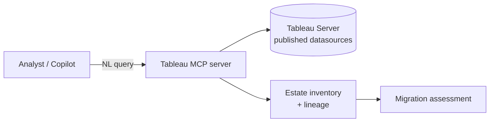
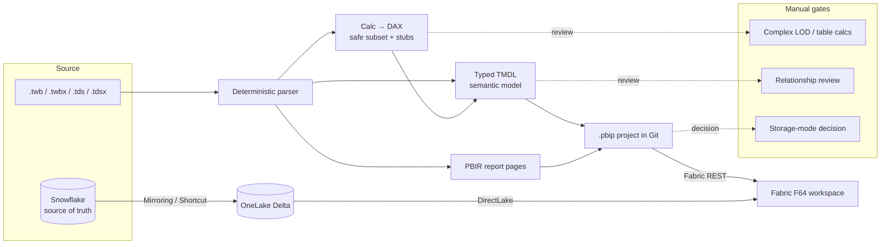
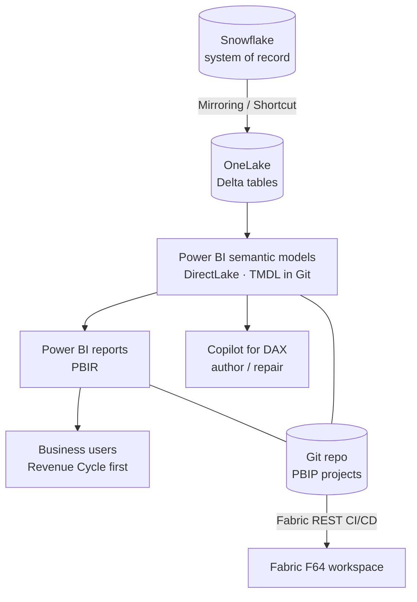

# Reference Architecture — Tableau → Power BI / Fabric

This document describes the target architecture, the **two migration motions**, and a
**phased, Revenue-Cycle-first** plan for the customer's estate (150+ workbooks, Snowflake as
source of truth, Fabric F64).

---

## Design principles

1. **Snowflake stays the source of truth.** No data fork. Fabric reads Snowflake via
   Mirroring / Shortcuts, and semantic models serve via **DirectLake**.
2. **Automate the mechanical, surface the judgement.** Schema, types, and safe-subset
   calc→DAX are deterministic and auditable. Complex calcs, relationships, and storage-mode
   decisions are explicit human gates — never silently guessed.
3. **Everything-as-code.** Semantic models and reports are **PBIP/TMDL** in Git; deployment
   to F64 is via **Fabric REST**. Migrations are reproducible and reviewable in PRs.
4. **Fidelity is provable.** Every migrated measure keeps its original Tableau formula as an
   annotation so reviewers can diff intent vs. translation.

---

## Two migration motions

You do not have to choose one. They are complementary and the pilot can start with either.

### Motion A — "AI on top" (keep Tableau, add Fabric intelligence)

Use the **official Tableau MCP server** for live natural-language query, lineage, and
inventory over published datasources. Value is fast (days), non-destructive, and de-risks the
estate by producing an accurate, live inventory that *feeds* Motion B.

### Motion B — Migration accelerator (rebuild on Fabric)

The `tableau-migration` engine parses workbooks/datasources **offline** and generates the
Fabric-native model + report as code, then deploys to F64.

---

## Target-state architecture

**Why DirectLake over Snowflake:** keeps Snowflake authoritative, avoids import refresh
windows at F64 scale, and lets the semantic model bind by table/schema name so the ingestion
path (Mirroring vs. Shortcut vs. staged Delta) can change without rewriting the model.

**Native-source rebind:** the engine emits the model with the source connection abstracted.
The live-pipeline step points those tables at the OneLake Delta landing of Snowflake. This is
a deliberate manual/config step (the offline demo proves model+calc generation; the rebind is
where real data lands).

---

## Phased plan — Revenue-Cycle-first

| Phase | Goal | Key activities | Exit criteria |
|---|---|---|---|
| **0. Assess** | Know the estate | Inventory workbooks/datasources; score calc complexity; identify shared datasources; size effort (`assessment-methodology.md`). | Ranked backlog + effort estimate for Revenue Cycle. |
| **1. Foundation** | Data landed on Fabric | Mirror/Shortcut Snowflake Revenue-Cycle schemas into OneLake; validate DirectLake. | Delta tables queryable at F64. |
| **2. Pilot migrate** | One domain proven | Run the accelerator on Revenue-Cycle datasources; auto-translate safe calcs; manually resolve complex LOD/table calcs with Copilot; rebind to DirectLake; deploy via REST. | Reports validated against source Tableau views by users. |
| **3. Harden** | Repeatable | CI/CD for PBIP via Git + Fabric REST; RLS; certification; performance tuning. | Green PR-to-workspace pipeline. |
| **4. Scale out** | Expand domains | Repeat by domain, reusing shared migrated semantic models; batch workbooks. | Estate coverage against the Phase-0 backlog. |

---

## What is automated vs. manual (architecture view)

| Layer | Automated | Manual / assisted |
|---|---|---|
| Schema & column types | ✅ From Tableau schema | — |
| Simple calcs & ratios | ✅ Deterministic DAX (`DIVIDE` etc.) | — |
| LOD / table calcs | ⚠️ Stubbed + preserved | ✅ Human + Copilot |
| Relationships | Inferred where join keys present | ✅ Review (esp. from `.twbx` fidelity) |
| Storage mode | Proposed | ✅ **Explicit decision** (Import vs. DirectLake) |
| Data landing / rebind | Model bound by name | ✅ Mirroring/Shortcut config |
| Deployment | ✅ Fabric REST | — |

> **Fidelity caveat:** a `.twbx`/`.twb` file gives model + calc + layout fidelity but not row
> data and may omit hidden join keys. The offline demo proves calc→DAX / TMDL / PBIP
> generation; **relationship inference and data landing are the live-pipeline (Phase 1–2)
> step**, best done against published datasources (via Tableau MCP / VDS) + Snowflake.
