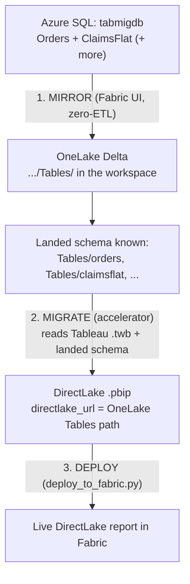

# DirectLake, Mirroring, and the Workbook ↔ Semantic Model Model

This document explains how the Tableau → Fabric accelerator produces a **DirectLake**
end state, where **mirroring** fits, and how Tableau **workbooks** map to Power BI semantic
models at estate scale. It is the reference for the live demo.

---

## 1. Two different jobs: mirror vs. migrate

The migration and the data landing are **separate jobs** that meet at one place — the
OneLake `Tables/` path.

| Job | What it does | Owner | Moves data? |
|---|---|---|---|
| **Mirroring** | Replicates Azure SQL tables into OneLake as Delta, near‑real‑time (~15s) | **Fabric** (native, zero‑ETL) | Yes |
| **Migration** | Reads Tableau `.twb/.tds`, generates the Power BI semantic model + report (`.pbip`) | **Accelerator** (offline, deterministic, stdlib‑only) | No — it only produces the model/report |
| **Deploy** | Pushes the `.pbip` into the workspace and wires `directlake_url` | `deploy_to_fabric.py` (deploy layer, uses az CLI) | No |

The accelerator **accepts** a `directlake_url`; it never **creates** the mirror. Landing
data is a Fabric concern and stays out of the stdlib engine by design.

---

## 2. The DirectLake flow

For **DirectLake**, the data must physically land as Delta in OneLake **before** the model
is deployed, because the accelerator is *faithful‑or‑stub*: it types the model from the
**actual landed Delta schema** and never guesses.



### When is mirroring needed?

| Target storage mode | Mirror needed? | Why |
|---|---|---|
| **DirectQuery** | ❌ No | Model queries Azure SQL live at every interaction |
| **Import** | ❌ No | Model loads a snapshot from the source at refresh |
| **DirectLake** | ✅ **Yes** | Model reads Delta from OneLake — the data must be landed there first |

The version already run successfully (4/7 workbooks bound) used **DirectQuery** — no mirror.
Mirroring is required **only because DirectLake was chosen**.

### Mirror via the UI (recommended for the demo)

The source server is **Entra‑only** (no password), which makes REST‑API mirror connections
fiddly. The Fabric portal UI is the reliable and visually compelling path:

> **New → Mirrored Azure SQL Database → point at `sql-tabmig-ysh95n` / `tabmigdb` → select the tables → Create.**

Once the mirror shows **Replicated**, grab its OneLake `Tables/` path and run the accelerator
in DirectLake mode against it.

---

## 3. Workbook ↔ semantic model — the 1:1 trap

### First, the Tableau object hierarchy

Getting the counts right depends on three distinct Tableau objects:

| Tableau object | What it is | Fabric equivalent |
|---|---|---|
| **Workbook** (`.twb`/`.twbx`) | The top‑level file. Holds many **views** + one or more **datasources**. | **1 Power BI report** (`.pbip`) |
| **View / Worksheet / Dashboard** | An individual visualization or page inside a workbook. Tableau Server calls these "views". | A **page/visual** inside the report |
| **Datasource** | The data model: connection + fields + calcs. **Embedded** in a workbook or **published** (shared across many workbooks). | **1 semantic model** |

So one **workbook** with 8 dashboards is **1 report with 8 pages** — not 8 reports. And its
datasource becomes **1 semantic model**.

The accelerator emits:

- **one semantic model per datasource**, and
- **one report per workbook** (a workbook spanning several datasources is either
  *consolidated into one model* or split into one report per datasource).

It also records a **binding signal** (`_workbook_binding_signal`) that detects whether a
workbook's primary datasource is **published/shared** (`connection_class == 'sqlproxy'`) or
**embedded**.

### What "150 workbooks" actually means

**150 Tableau workbooks ≠ 150 semantic models.**

The number of semantic models equals the number of **distinct datasources**, not the number
of workbooks. In a real estate, most of those 150 workbooks connect to a **much smaller**
set of **published datasources** (often 20–40). The Fabric best‑practice target is:

```
150 Tableau workbooks  →  150 thin reports
                          +  ~25 shared semantic models
   (one report each)         (one per DISTINCT datasource, deduped)
```

The estate motion is therefore:

1. **Dedup datasources** — the same published datasource used by 30 workbooks collapses to
   **one** shared semantic model, not 30.
2. **Build a governed set of shared semantic models** (one per distinct datasource).
3. **Rebuild each workbook as a thin report** that binds to those shared models.

> **Current state (honest):** the engine rebuilds the *embedded* model per workbook and
> **records** the published‑vs‑embedded signal. The automatic *rebind‑to‑shared* routing is
> the next step and is not fully wired yet. So today the demo shows per‑workbook models plus
> the detection that drives consolidation.

More Azure SQL tables mirrored into OneLake ⇒ more Delta tables ⇒ richer shared models the
reports can bind to.

---

## 4. Demo environment (current)

| Resource | Value |
|---|---|
| Fabric capacity | `hlsfabricdemo` (F128, westus3) |
| Fabric workspace | `tableau-directlake-demo` (`abde4b51-c6b2-4861-96cf-833857c7cf95`) |
| Lakehouse (fallback landing) | `2ba6e4e7-7f33-40fb-aff4-a6c60815c0d0` |
| OneLake `Tables/` (`directlake_url`) | `https://onelake.dfs.fabric.microsoft.com/abde4b51.../2ba6e4e7.../Tables` |
| Azure SQL source | `sql-tabmig-ysh95n.database.windows.net` / `tabmigdb` (Entra‑only, GeneralPurpose Serverless) |

---

## 5. Scaling the demo to 10 workbooks

The demo grows by adding **Azure SQL–backed** Tableau workbooks — those are the ones that
mirror into OneLake and produce Delta tables. Excel/`.hyper`‑backed workbooks do not mirror.

Plan:

1. **Seed more Azure SQL tables** in `tabmigdb` (e.g. `Patients`, `Providers`, `Payers`,
   `Encounters`, `Departments`) so there is more to mirror.
2. **Add Tableau workbooks** over those tables to reach 10 SQL‑backed workbooks.
3. **Mirror** all the tables into `tableau-directlake-demo`.
4. **Run the accelerator** in DirectLake mode against the landed Delta.

This directly demonstrates: more source tables → more OneLake Delta → more shared semantic
models → more thin reports.
