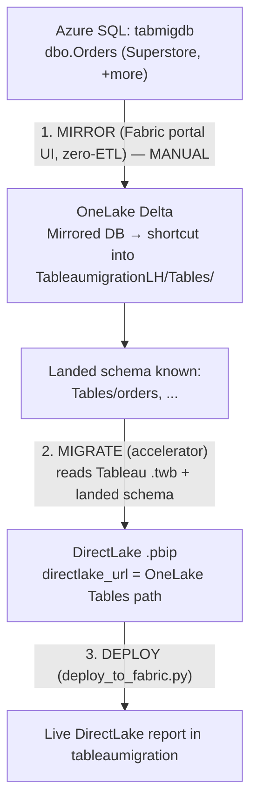

# DirectLake, Mirroring, and the Workbook ↔ Semantic Model Model

This document explains how the Tableau → Fabric accelerator produces a **DirectLake**
end state, where **mirroring** fits, and how Tableau **workbooks** map to Power BI semantic
models at estate scale. It is the reference for the live demo.

---

## 1. Two different jobs: mirror vs. migrate

The migration and the data landing are **separate jobs** that meet at one place — the
OneLake `Tables/` path.

| Job | What it does | Owner | Moves data? |
|---|---|---|---|
| **Mirroring** | Replicates Azure SQL tables into OneLake as Delta, near‑real‑time (~15s) | **Fabric** (native, zero‑ETL) | Yes |
| **Migration** | Reads Tableau `.twb/.tds`, generates the Power BI semantic model + report (`.pbip`) | **Accelerator** (offline, deterministic, stdlib‑only) | No — it only produces the model/report |
| **Deploy** | Pushes the `.pbip` into the workspace and wires `directlake_url` | `deploy_to_fabric.py` (deploy layer, uses az CLI) | No |

The accelerator **accepts** a `directlake_url`; it never **creates** the mirror. Landing
data is a Fabric concern and stays out of the stdlib engine by design.

---

## 2. The DirectLake flow

### Prerequisite — create the workspace and lakehouse *first*

> **Before you run any code**, the target **Fabric workspace** and a **Lakehouse** inside it
> must already exist. The DirectLake model is nothing but pointers into a lakehouse's OneLake
> `Tables/` path, and the mirror/land step needs somewhere to write Delta — so both are
> **inputs**, not outputs. The accelerator never creates them.
>
> 1. In the Fabric portal, create a **workspace** on a Fabric capacity (e.g. `tableaumigration`).
> 2. Inside it, create a **Lakehouse** (e.g. `TableaumigrationLH`).
> 3. Copy the lakehouse's OneLake `Tables/` path — that becomes `directlake_url`.
>
> DirectQuery/Import need neither of these; they are required **only** for the DirectLake path.

For **DirectLake**, the data must physically land as Delta in OneLake **before** the model
is deployed, because the accelerator is *faithful‑or‑stub*: it types the model from the
**actual landed Delta schema** and never guesses.



### When is mirroring needed?

| Target storage mode | Mirror needed? | Why |
|---|---|---|
| **DirectQuery** | ❌ No | Model queries Azure SQL live at every interaction |
| **Import** | ❌ No | Model loads a snapshot from the source at refresh |
| **DirectLake** | ✅ **Yes** | Model reads Delta from OneLake — the data must be landed there first |

The version already run successfully (4/7 workbooks bound) used **DirectQuery** — no mirror.
Mirroring is required **only because DirectLake was chosen**.

### Mirror via the UI — the manual step the user performs

There is **no clean REST API** to stand up Azure SQL mirroring (the source here is
**Entra‑only**, no password, which makes any API connection route unreliable). So **this one
step is done by hand in the Fabric portal.** Everything before it (migrate) and after it
(generate DirectLake model, deploy) is automated — the mirror is the single human click‑path.

**Do this in the `tableaumigration` workspace:**

1. **New → Mirrored Azure SQL Database.**
   > **Pick the right mirror type.** The source here is an **Azure SQL logical server**
   > (`*.database.windows.net`, created via `az sql server`), so the correct choice is
   > **Mirrored Azure SQL Database** — *not* **Mirrored SQL Server**, which is only for
   > SQL Server 2025 running on‑prem / on a VM / Arc‑enabled.
2. **New connection** to the source:
   - Server: `sql-tabmig-ysh95n.database.windows.net`
   - Database: `tabmigdb`
   - Authentication: **Organizational account** (Entra) — sign in as the same admin.
3. **Select the tables** to replicate — at minimum `dbo.Orders` (add others as the demo grows).
4. **Create.** Wait until each table shows **Replicated** (initial snapshot, then continuous).

> **Prereq 1 — system‑assigned managed identity (SAMI).** Mirroring an Azure SQL Database
> requires the **logical server's system‑assigned managed identity to be enabled and set as
> the *primary* identity**. Without it the mirror fails with:
> *"Please turn on the system-assigned managed identity and set it as the primary identity
> for your SQL Server."* Enable it once with az CLI:
>
> ```bash
> az sql server update -g rg-tableau-migration -n sql-tabmig-ysh95n -i --identity-type SystemAssigned
> ```
>
> With no user‑assigned identity present, `SystemAssigned` is automatically the primary.
> Verify with `az sql server show ... --query identity.type` → `SystemAssigned`.

> **Prereq 2 — network reachability:** the SQL server must allow Fabric to reach it —
> `publicNetworkAccess = Enabled` **and** the firewall setting *"Allow Azure services and
> resources to access this server"* turned on (or the workspace's outbound IPs allow‑listed).

### After mirroring: shortcut the tables into the lakehouse

Mirroring lands Delta inside a **Mirrored Database** item — *not* automatically inside
`TableaumigrationLH`. To make those tables show up under the lakehouse `Tables/` path that
`directlake_url` points at, add a **shortcut**:

> In **`TableaumigrationLH` → Tables → New shortcut → Microsoft OneLake → the Mirrored
> Database → select the mirrored tables.**

(Alternatively, point `directlake_url` straight at the Mirrored Database's own OneLake
`Tables/` path and skip the shortcut — either lands the model on the same Delta.)

**Then hand back one thing:** confirmation the tables are visible under
`TableaumigrationLH/Tables/` (or the Mirrored DB's `Tables/` path). That is the signal the
automated steps 2–3 can resume — generate the DirectLake model typed from the landed schema
and deploy it.

---

## 3. Workbook ↔ semantic model — the 1:1 trap

### First, the Tableau object hierarchy

Getting the counts right depends on three distinct Tableau objects:

| Tableau object | What it is | Fabric equivalent |
|---|---|---|
| **Workbook** (`.twb`/`.twbx`) | The top‑level file. Holds many **views** + one or more **datasources**. | **1 Power BI report** (`.pbip`) |
| **View / Worksheet / Dashboard** | An individual visualization or page inside a workbook. Tableau Server calls these "views". | A **page/visual** inside the report |
| **Datasource** | The data model: connection + fields + calcs. **Embedded** in a workbook or **published** (shared across many workbooks). | **1 semantic model** |

So one **workbook** with 8 dashboards is **1 report with 8 pages** — not 8 reports. And its
datasource becomes **1 semantic model**.

The accelerator emits:

- **one semantic model per datasource**, and
- **one report per workbook** (a workbook spanning several datasources is either
  *consolidated into one model* or split into one report per datasource).

It also records a **binding signal** (`_workbook_binding_signal`) that detects whether a
workbook's primary datasource is **published/shared** (`connection_class == 'sqlproxy'`) or
**embedded**.

### What "150 workbooks" actually means

**150 Tableau workbooks ≠ 150 semantic models.**

The number of semantic models equals the number of **distinct datasources**, not the number
of workbooks. In a real estate, most of those 150 workbooks connect to a **much smaller**
set of **published datasources** (often 20–40). The Fabric best‑practice target is:

```
150 Tableau workbooks  →  150 thin reports
                          +  ~25 shared semantic models
   (one report each)         (one per DISTINCT datasource, deduped)
```

The estate motion is therefore:

1. **Dedup datasources** — the same published datasource used by 30 workbooks collapses to
   **one** shared semantic model, not 30.
2. **Build a governed set of shared semantic models** (one per distinct datasource).
3. **Rebuild each workbook as a thin report** that binds to those shared models.

> **Current state (honest):** the engine rebuilds the *embedded* model per workbook and
> **records** the published‑vs‑embedded signal. The automatic *rebind‑to‑shared* routing is
> the next step and is not fully wired yet. So today the demo shows per‑workbook models plus
> the detection that drives consolidation.

More Azure SQL tables mirrored into OneLake ⇒ more Delta tables ⇒ richer shared models the
reports can bind to.

---

## 4. Demo environment (current)

| Resource | Value |
|---|---|
| Fabric workspace | `tableaumigration` (`ad36bc5f-ee17-439b-af0c-a867904980f4`) |
| Lakehouse (landing target) | `TableaumigrationLH` (`c569eabc-bb15-4923-9c87-808c163f2c8d`) |
| OneLake `Tables/` (`directlake_url`) | `https://onelake.dfs.fabric.microsoft.com/ad36bc5f-ee17-439b-af0c-a867904980f4/c569eabc-bb15-4923-9c87-808c163f2c8d/Tables` |
| Azure SQL source | `sql-tabmig-ysh95n.database.windows.net` / `tabmigdb` (Entra‑only, GeneralPurpose Serverless) |

> **Both the workspace and the lakehouse above were created in the Fabric portal *before* any
> code ran** — see the prerequisite in §2. They are inputs to the deploy, never created by it.

---

## 5. Scaling the demo to 10 workbooks

The demo grows by adding **Azure SQL–backed** Tableau workbooks — those are the ones that
mirror into OneLake and produce Delta tables. Excel/`.hyper`‑backed workbooks do not mirror.

Plan:

1. **Seed more Azure SQL tables** in `tabmigdb` (e.g. `Patients`, `Providers`, `Payers`,
   `Encounters`, `Departments`) so there is more to mirror.
2. **Add Tableau workbooks** over those tables to reach 10 SQL‑backed workbooks.
3. **Mirror / land** all the tables into `tableaumigration` (`TableaumigrationLH`).
4. **Run the accelerator** in DirectLake mode against the landed Delta.

This directly demonstrates: more source tables → more OneLake Delta → more shared semantic
models → more thin reports.
