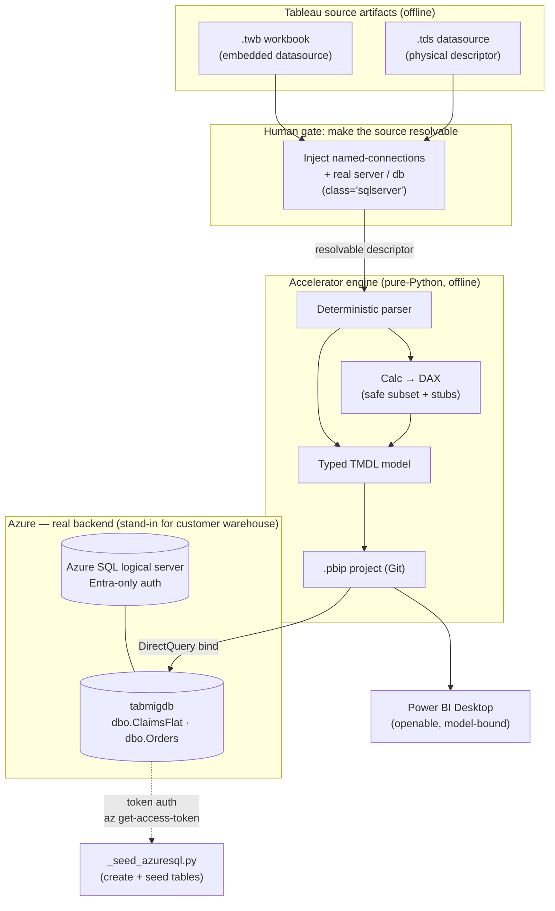

# Runbook — Binding a Migrated Model to a Real SQL Source (Path B)

> **What this document is.** A complete, reproducible record of the "real source"
> migration motion we executed end-to-end, written so **another engineer or customer
> can repeat it from zero**. It also validates the approach against how enterprises
> actually run Tableau → Power BI / Fabric migrations, and flags where the accelerator
> already follows best practice vs. where a human decision is required.
>
> Companion docs: [architecture.md](architecture.md) (reference architecture + the two
> motions), [assessment-methodology.md](assessment-methodology.md) (estate sizing),
> [customer-response.md](customer-response.md) (honest answers to the customer's questions).

---

## 1. The problem this solves

The accelerator parses Tableau `.twb`/`.tds` files **offline** and generates a typed TMDL
semantic model + calc→DAX + an openable `.pbip`. That proves the *mechanical* 80%.

But a Tableau workbook only describes **where its data lives** — it does not carry the data
or, in many cases, a resolvable physical connection. Two workbooks in the customer estate
(`RevenueCycleFlat`, `Superstore-classic`) had embedded datasources whose connection was
`class='federated'` with **no `<named-connections>` block** — no server, no database, no
class. The engine correctly refused to guess and routed them to a **storage decision**
(`Connector class 'unknown' is not mapped … storage decision required`).

To finish the migration, the model must be **bound to a real, reachable source**. That is
this runbook: stand up a real SQL backend, give the datasource a resolvable physical
descriptor, and re-run — so the two blocked workbooks flip from *unbound* to *model-bound,
openable `.pbip`*.

This is the **"native-source rebind" / Phase 1–2 live-pipeline step** from
[architecture.md](architecture.md), executed against **Azure SQL** as a stand-in for the
customer's warehouse (Snowflake / Fabric SQL / Azure SQL — the pattern is identical).

---

## 2. What we actually did (the record)

### 2.1 Why Azure SQL (not Fabric SQL) for this run

The two `.tds` files already describe `class='sqlserver'` with a
`*.database.windows.net` server. That is an **exact Azure SQL Database match** — zero
descriptor rework. Fabric SQL uses a different connector class
(`microsoft_fabric_sql_endpoint`) and would have required editing the class in every
descriptor. For a real customer on Snowflake, the same logic applies: match the descriptor
class to the actual warehouse.

### 2.2 Azure resources provisioned

| Resource | Value | Notes |
|---|---|---|
| Subscription | `ME-MngEnvMCAP661056-kwamesefah-1` | MCAP-governed sandbox |
| Resource group | `rg-tableau-migration` | |
| Logical server | `sql-tabmig-w3a7k9.database.windows.net` | Region **westus3** (eastus2 was capacity-blocked) |
| Database | `tabmigdb` | Basic tier (~$5/mo) |
| Auth model | **Microsoft Entra-only** (`--enable-ad-only-auth`) | **No SQL password created or stored** — see §6 |
| Firewall | `AllowMyClientIP` (client IP), `AllowAzureServices` (0.0.0.0) | |

**Governance gotcha (worth remembering):** the subscription inherits an Azure Policy that
force-disabled `publicNetworkAccess`. `az sql server update --set publicNetworkAccess=Enabled`
**silently reverted** (Modify/Deny policy from the management group). It had to be enabled
**in the portal UI**, after which the firewall rules applied cleanly. On a real customer
tenant, expect the same class of policy friction — plan for a **private endpoint** instead of
public access in production (see §5).

### 2.3 Tables + sample data

Two tables were created with **physical column names taken verbatim from the `.tds`
`remote-name` metadata** (spaces preserved, e.g. `[Charge Amount]`), then seeded with
synthetic rows so an Import model would have data:

- `dbo.ClaimsFlat` — 16 columns, 500 rows (revenue-cycle claim grain)
- `dbo.Orders` — 5 columns, 300 rows (Superstore order grain)

Seed script: [../_seed_azuresql.py](../_seed_azuresql.py). It connects with a
**Microsoft Entra access token** (no password) via `pyodbc` + *ODBC Driver 18*:

```python
# az account get-access-token --resource https://database.windows.net/
# → UTF-16-LE encode, 4-byte length prefix, attrs_before={1256: token}
```

### 2.4 Rebinding the datasources

Two edits per source, pointing everything at the real server/db:

1. **`.tds` files** — swapped the placeholder server/db for the real ones:
   - `placeholder-revcycle.database.windows.net` → `sql-tabmig-w3a7k9.database.windows.net`
   - `dbname='RevCycleDW'` / `dbname='StoreDW'` → `dbname='tabmigdb'`
2. **`.twb` files** — the real fix. The workbook's *embedded* datasource had
   `<connection class='federated'>` with **no named-connections**. We injected the missing
   block and rewired the relation:

```xml
<connection class='federated'>
  <named-connections>
    <named-connection caption='claims' name='sqlserver.claims'>
      <connection authentication='sqlserver' class='sqlserver' dbname='tabmigdb'
                  server='sql-tabmig-w3a7k9.database.windows.net' username='svc_placeholder' />
    </named-connection>
  </named-connections>
  <relation connection='sqlserver.claims' name='ClaimsFlat' table='[dbo].[ClaimsFlat]' type='table' />
  ...
```

> **Key insight:** a standalone `.tds` fix does **not** reach a `.twb`'s embedded copy of the
> datasource. Each `.twb` carries its own inline datasource; that copy is what the engine
> reads. Both had to be given a resolvable physical descriptor.

### 2.5 Result

Re-running the estate migration moved workbook binding **2/7 → 4/7**:

| Workbook | Before | After |
|---|---|---|
| `RevenueCycleFlat` | unbound (storage decision) | ✅ bound → `RevenueCycleFlat.SemanticModel` (DirectQuery) |
| `Superstore-classic` | unbound (storage decision) | ✅ bound → `Superstore-classic.SemanticModel` (DirectQuery) |
| `SuperstorePerformance`, `TableCalcShowcase` | bound | bound (unchanged) |
| `RegionalSample` | blocked (`.hyper`, needs `tableauhyperapi`, x64-only) | still blocked — **not** a SQL problem |
| `Superstore-packaged`, `WorldIndicators` | blocked (Excel, no resolvable columns) | still blocked — **not** a SQL problem |

> A live SQL source **auto-selects DirectQuery**, not Import. To ship a true **Import** model
> you enable an extract or explicitly opt Import as the storage decision — the engine never
> silently lands data to Delta (that is an explicit opt-in). See §4.

---

## 3. Reproduce it from zero (for a new customer / engineer)

Prereqs: Azure CLI (logged in), Python 3.11, `pyodbc` + *ODBC Driver 18 for SQL Server*,
the accelerator repo.

```powershell
# 0) Pick a unique server name + a region with SQL capacity
$rg   = "rg-tableau-migration"
$srv  = "sql-tabmig-<random>"          # must be globally unique
$db   = "tabmigdb"
$loc  = "westus3"
$me   = az ad signed-in-user show --query userPrincipalName -o tsv
$oid  = az ad signed-in-user show --query id -o tsv
$myip = (Invoke-RestMethod https://api.ipify.org)

# 1) Resource group + Entra-only SQL server (NO password)
az group create -n $rg -l $loc
az sql server create -n $srv -g $rg -l $loc `
  --enable-ad-only-auth --external-admin-principal-type User `
  --external-admin-name $me --external-admin-sid $oid

# 2) Public network access (portal UI if a policy reverts the CLI) + firewall
az sql server update -n $srv -g $rg --set publicNetworkAccess=Enabled
az sql server firewall-rule create -g $rg -s $srv -n AllowMyClientIP `
  --start-ip-address $myip --end-ip-address $myip
az sql server firewall-rule create -g $rg -s $srv -n AllowAzureServices `
  --start-ip-address 0.0.0.0 --end-ip-address 0.0.0.0

# 3) Database
az sql db create -g $rg -s $srv -n $db --edition Basic

# 4) Create tables from the .tds remote-name columns + seed rows (Entra token auth)
#    Adapt _seed_azuresql.py: SERVER/DATABASE + the CREATE TABLE column list must
#    match each datasource's <remote-name> metadata verbatim (keep the spaces).
py -3.11 _seed_azuresql.py

# 5) Give every datasource a resolvable physical descriptor
#    - .tds: set real server= and dbname=
#    - .twb: inject <named-connections> + rewire <relation connection='...'>
#    (see section 2.4)

# 6) Re-run the migration and read the summary
py -3.11 engine\skills\tableau-migration\scripts\migrate_estate.py `
  -i .\customer-estate -o .\output-estate --force
#    → output-estate\summary.md : confirm the target workbooks flip to "bound"
```

**Definition of done:** the target workbook rows in `output-estate/summary.md` show a bound
model + an openable `pbip/<Name>/<Name>.pbip` (double-click in Power BI Desktop).

---

## 4. Storage-mode decision (Import vs. DirectQuery vs. DirectLake)

The engine **never guesses** this — it is the one deliberate human gate. What we observed:

| Choice | When the engine picks / recommends it | Trade-off |
|---|---|---|
| **DirectQuery** | Default when a live SQL source resolves (what happened here). | No refresh window; query latency + source load per interaction. |
| **Import** | Explicit opt-in, or when an extract is present. | Fast queries; needs a refresh schedule; data copied into the model. |
| **DirectLake** (Fabric) | Explicit opt-in — land source to OneLake Delta, bind by name. | Best of both at scale; requires Fabric + a landing pipeline (Shortcut). |

> The engine's scaffold message is deliberate: *"default to a direct-to-source Import rebuild,
> or opt in to land-to-Delta + DirectLake (**never auto-selected**)."* This is a
> **best-practice guardrail** — data movement is never silent.

---

## 5. Architecture of what we did



**How this maps to the reference architecture:** this is exactly the *"native-source rebind"*
box in [architecture.md](architecture.md) — Phase 1 (data landed) + Phase 2 (pilot migrate,
rebind, validate). Azure SQL here plays the role Snowflake/OneLake plays at the customer.

---

## 6. Security notes (what we did right, and why)

- **Entra-only auth, no SQL password.** The server was created with `--enable-ad-only-auth`.
  No secret was generated or stored anywhere in the repo. All table creation used a
  short-lived **Entra access token**. Credentials remain the operator's responsibility.
- **Least-exposure networking.** Public access + a client-IP firewall rule was used *only*
  because this is a throwaway sandbox. **For a real customer, use a Private Endpoint** and
  keep `publicNetworkAccess=Disabled` — which is what the inherited Azure Policy was already
  enforcing. Do not fight the policy in production; satisfy it.
- **No production data.** Tables were seeded with synthetic rows. Never seed a migration
  sandbox from real PHI/PII — bind to a governed source or use masked/synthetic data.
- **Cost hygiene.** The server + DB cost ~$5/mo. Tear down with
  `az group delete -n rg-tableau-migration --yes` when the pilot is done.

---

## 7. Is this what real customers actually do? (best-practice validation)

**Yes — with one framing correction.** Enterprise Tableau → Power BI/Fabric migrations do
*not* try to carry data inside the BI artifact. The standard, recommended motion is:

1. **Keep the warehouse authoritative** (Snowflake / Azure SQL / Fabric SQL). The BI model
   binds to it by server + table name. We did exactly this (Azure SQL as the warehouse).
2. **Rebind the migrated model to the live source** as an explicit step — because a Tableau
   file describes a connection but doesn't guarantee a *resolvable* one. This is the single
   most common "why won't it bind" issue in real projects, and the accelerator surfaces it
   as an explicit gate instead of silently producing a partial model. ✅ best practice.
3. **Choose storage mode deliberately** — DirectQuery/Import for SQL, DirectLake for Fabric —
   never let a tool move data implicitly. The engine enforces this. ✅ best practice.
4. **Everything-as-code** — the output is a `.pbip`/TMDL project that lands in Git and
   deploys via Fabric REST, so migrations are reviewable in PRs. ✅ best practice.

**Where the accelerator is already aligned with field best practice:**

| Best practice (real projects) | Accelerator behavior |
|---|---|
| Never guess an ambiguous connection | Routes `unknown` connectors to an explicit storage decision |
| Never silently move/copy data | `land-to-Delta + DirectLake` is opt-in, "never auto-selected" |
| Preserve source intent for audit | Original Tableau formula kept as an annotation on each measure |
| Deterministic, offline, no live Tableau needed | Pure-Python engine, zero pip for the core path |
| Human owns the 20% | LOD/table calcs stubbed + surfaced, not faked |

**Where a human still decides (by design, not a gap):**

- Complex LOD / table calcs (`RUNNING_SUM`, `RANK`, `WINDOW_AVG`, nested FIXED) → stubbed,
  preserved, resolved with Copilot in the second-compiler pass.
- Relationship review when join keys aren't explicit in the file.
- Storage-mode choice (§4).
- The **native-source rebind itself** — which is this runbook.

**Honest limitations (not solvable by a SQL backend):**

- `.hyper` extracts inside packaged `.twbx` need `tableauhyperapi` (x64-only; the one gap on
  Windows-on-ARM). Bind to the live warehouse instead — the usual real-project path.
- Excel/flat sources with no resolvable column metadata can't be typed deterministically and
  stay a storage decision until a real connection is supplied.

---

## 8. TL;DR for a reviewer

- We finished the migration for two workbooks the engine correctly refused to guess, by
  standing up a **real Azure SQL source** and giving each datasource a **resolvable physical
  descriptor** — the textbook *native-source rebind*.
- Binding went **2/7 → 4/7**; the remaining 3 are `.hyper`/Excel limitations, not SQL ones.
- Every guardrail the engine enforced (no silent data movement, explicit storage decision,
  preserved formulas, Entra-only auth) **matches how real enterprise migrations are run.**
- Production hardening deltas: **Private Endpoint** over public access, a **governed source**
  over synthetic seed data, and a chosen **storage mode** (DirectLake at Fabric F64 scale).
